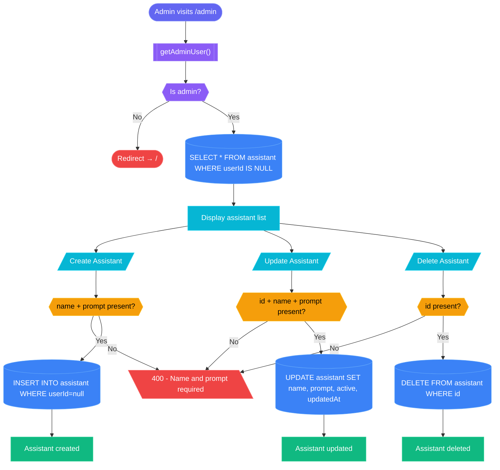

```mermaid
flowchart TD
    A(["Admin visits /admin"]) --> B[["getAdminUser()"]]
    B --> C{{"Is admin?"}}
    C -->|No| D(["Redirect → /"])
    C -->|Yes| E[("SELECT * FROM assistant WHERE userId IS NULL")]
    E --> F["Display assistant list"]

    F --> G[/"Create Assistant"/]
    G --> H{{"name + prompt present?"}}
    H -->|No| I[\"400 - Name and prompt required"\]
    H -->|Yes| J[("INSERT INTO assistant WHERE userId=null")]
    J --> K["Assistant created"]

    F --> L[/"Update Assistant"/]
    L --> M{{"id + name + prompt present?"}}
    M -->|No| I
    M -->|Yes| N[("UPDATE assistant SET name, prompt, active, updatedAt")]
    N --> O["Assistant updated"]

    F --> P[/"Delete Assistant"/]
    P --> Q{{"id present?"}}
    Q -->|No| I
    Q -->|Yes| R[("DELETE FROM assistant WHERE id")]
    R --> S["Assistant deleted"]

    classDef entry fill:#6366f1,stroke:#818cf8,color:#fff
    classDef validation fill:#f59e0b,stroke:#fbbf24,color:#000
    classDef success fill:#10b981,stroke:#34d399,color:#fff
    classDef error fill:#ef4444,stroke:#f87171,color:#fff
    classDef external fill:#8b5cf6,stroke:#a78bfa,color:#fff
    classDef data fill:#3b82f6,stroke:#60a5fa,color:#fff
    classDef user fill:#06b6d4,stroke:#22d3ee,color:#fff

    class A entry
    class C,H,M,Q validation
    class K,O,S success
    class D,I error
    class B,C external
    class E,J,N,R data
    class F,G,L,P user
```
