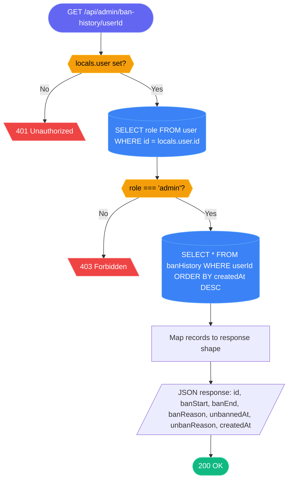

```mermaid
flowchart TD
    A(["GET /api/admin/ban-history/userId"]) --> B{{"locals.user set?"}}
    B -->|No| C[\"401 Unauthorized"\]
    B -->|Yes| D[("SELECT role FROM user WHERE id = locals.user.id")]
    D --> E{{"role === 'admin'?"}}
    E -->|No| F[\"403 Forbidden"\]
    E -->|Yes| G[("SELECT * FROM banHistory WHERE userId ORDER BY createdAt DESC")]
    G --> H["Map records to response shape"]
    H --> I[/"JSON response: id, banStart, banEnd, banReason, unbannedAt, unbanReason, createdAt"/]
    I --> J(["200 OK"])

    classDef entry fill:#6366f1,stroke:#818cf8,color:#fff
    classDef validation fill:#f59e0b,stroke:#fbbf24,color:#000
    classDef success fill:#10b981,stroke:#34d399,color:#fff
    classDef error fill:#ef4444,stroke:#f87171,color:#fff
    classDef data fill:#3b82f6,stroke:#60a5fa,color:#fff

    class A entry
    class B,E validation
    class J success
    class C,F error
    class D,G data
    class H,I processing
```
