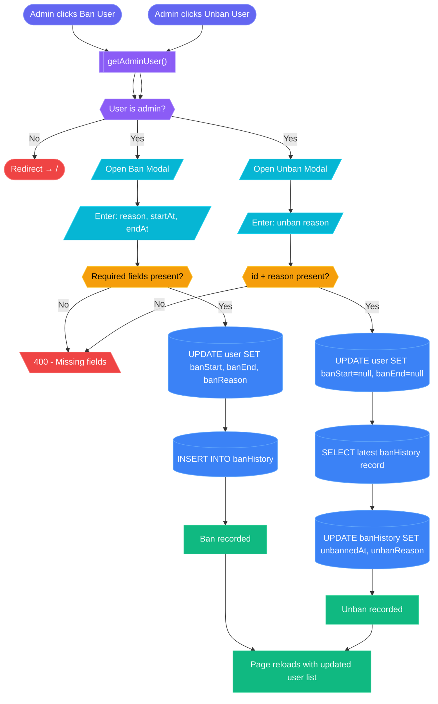

```mermaid
flowchart TD
    A(["Admin clicks Ban User"]) --> B[["getAdminUser()"]]
    B --> C{{"User is admin?"}}
    C -->|No| D(["Redirect → /"])
    C -->|Yes| E[/Open Ban Modal/]
    E --> F[/"Enter: reason, startAt, endAt"/]
    F --> G{{"Required fields present?"}}
    G -->|No| H[\"400 - Missing fields"\]
    G -->|Yes| I[("UPDATE user SET banStart, banEnd, banReason")]
    I --> J[("INSERT INTO banHistory")]
    J --> K["Ban recorded"]
    K --> L["Page reloads with updated user list"]

    A2(["Admin clicks Unban User"]) --> B
    B --> C
    C -->|Yes| M[/Open Unban Modal/]
    M --> N[/"Enter: unban reason"/]
    N --> O{{"id + reason present?"}}
    O -->|No| H
    O -->|Yes| P[("UPDATE user SET banStart=null, banEnd=null")]
    P --> Q[("SELECT latest banHistory record")]
    Q --> R[("UPDATE banHistory SET unbannedAt, unbanReason")]
    R --> S["Unban recorded"]
    S --> L

    classDef entry fill:#6366f1,stroke:#818cf8,color:#fff
    classDef validation fill:#f59e0b,stroke:#fbbf24,color:#000
    classDef success fill:#10b981,stroke:#34d399,color:#fff
    classDef error fill:#ef4444,stroke:#f87171,color:#fff
    classDef external fill:#8b5cf6,stroke:#a78bfa,color:#fff
    classDef data fill:#3b82f6,stroke:#60a5fa,color:#fff
    classDef user fill:#06b6d4,stroke:#22d3ee,color:#fff

    class A,A2 entry
    class C,G,O validation
    class K,L,S success
    class D,H error
    class B,C external
    class I,J,P,Q,R data
    class E,F,M,N user
```
