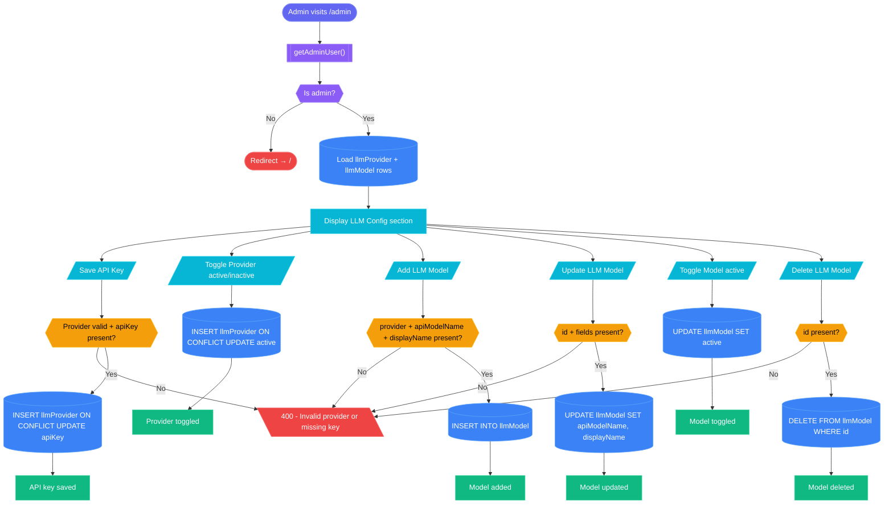

```mermaid
flowchart TD
    A(["Admin visits /admin"]) --> B[["getAdminUser()"]]
    B --> C{{"Is admin?"}}
    C -->|No| D(["Redirect → /"])
    C -->|Yes| E[("Load llmProvider + llmModel rows")]
    E --> F["Display LLM Config section"]

    F --> G[/"Save API Key"/]
    G --> H{{"Provider valid + apiKey present?"}}
    H -->|No| I[\"400 - Invalid provider or missing key"\]
    H -->|Yes| J[("INSERT llmProvider ON CONFLICT UPDATE apiKey")]
    J --> K["API key saved"]

    F --> L[/"Toggle Provider active/inactive"/]
    L --> M[("INSERT llmProvider ON CONFLICT UPDATE active")]
    M --> N["Provider toggled"]

    F --> O[/"Add LLM Model"/]
    O --> P{{"provider + apiModelName + displayName present?"}}
    P -->|No| I
    P -->|Yes| Q[("INSERT INTO llmModel")]
    Q --> R["Model added"]

    F --> S[/"Update LLM Model"/]
    S --> T{{"id + fields present?"}}
    T -->|No| I
    T -->|Yes| U[("UPDATE llmModel SET apiModelName, displayName")]
    U --> V["Model updated"]

    F --> W[/"Toggle Model active"/]
    W --> X[("UPDATE llmModel SET active")]
    X --> Y["Model toggled"]

    F --> Z[/"Delete LLM Model"/]
    Z --> AA{{"id present?"}}
    AA -->|No| I
    AA -->|Yes| AB[("DELETE FROM llmModel WHERE id")]
    AB --> AC["Model deleted"]

    classDef entry fill:#6366f1,stroke:#818cf8,color:#fff
    classDef validation fill:#f59e0b,stroke:#fbbf24,color:#000
    classDef success fill:#10b981,stroke:#34d399,color:#fff
    classDef error fill:#ef4444,stroke:#f87171,color:#fff
    classDef external fill:#8b5cf6,stroke:#a78bfa,color:#fff
    classDef data fill:#3b82f6,stroke:#60a5fa,color:#fff
    classDef user fill:#06b6d4,stroke:#22d3ee,color:#fff

    class A entry
    class C,H,P,T,AA validation
    class K,N,R,V,Y,AC success
    class D,I error
    class B,C external
    class E,J,M,Q,U,X,AB data
    class F,G,L,O,S,W,Z user
```
