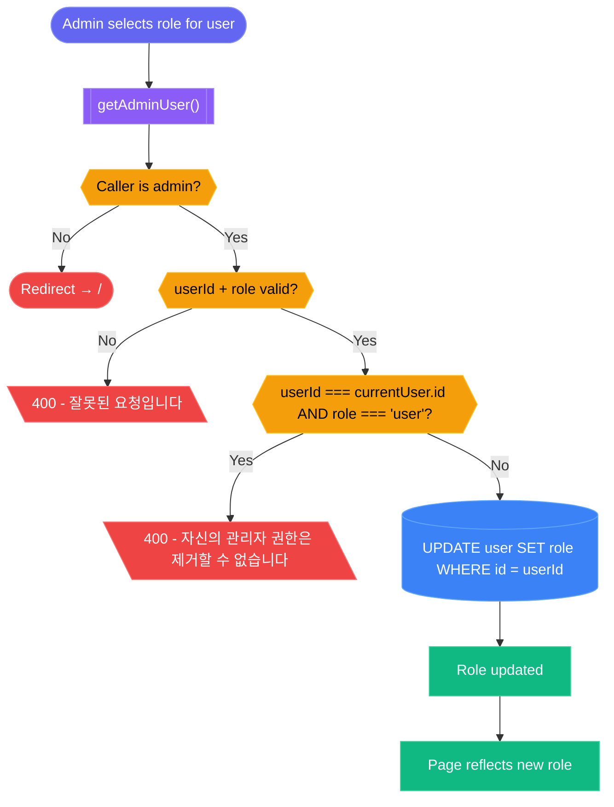

```mermaid
flowchart TD
    A(["Admin selects role for user"]) --> B[["getAdminUser()"]]
    B --> C{{"Caller is admin?"}}
    C -->|No| D(["Redirect → /"])
    C -->|Yes| E{{"userId + role valid?"}}
    E -->|No| F[\"400 - 잘못된 요청입니다"\]
    E -->|Yes| G{{"userId === currentUser.id AND role === 'user'?"}}
    G -->|Yes| H[\"400 - 자신의 관리자 권한은 제거할 수 없습니다"\]
    G -->|No| I[("UPDATE user SET role WHERE id = userId")]
    I --> J["Role updated"]
    J --> K["Page reflects new role"]

    classDef entry fill:#6366f1,stroke:#818cf8,color:#fff
    classDef validation fill:#f59e0b,stroke:#fbbf24,color:#000
    classDef success fill:#10b981,stroke:#34d399,color:#fff
    classDef error fill:#ef4444,stroke:#f87171,color:#fff
    classDef external fill:#8b5cf6,stroke:#a78bfa,color:#fff
    classDef data fill:#3b82f6,stroke:#60a5fa,color:#fff

    class A entry
    class C,E,G validation
    class J,K success
    class D,F,H error
    class B external
    class I data
```
