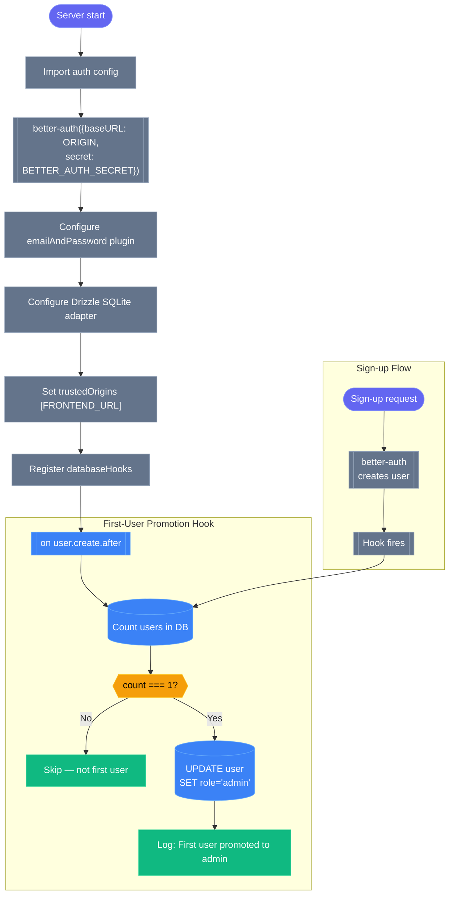

```mermaid
flowchart TD
    A(["Server start"]) --> B["Import auth config"]
    B --> C[["better-auth({baseURL: ORIGIN,\nsecret: BETTER_AUTH_SECRET})"]]
    C --> D["Configure emailAndPassword plugin"]
    D --> E["Configure Drizzle SQLite adapter"]
    E --> F["Set trustedOrigins [FRONTEND_URL]"]
    F --> G["Register databaseHooks"]
    G --> H[["on user.create.after"]]

    subgraph "First-User Promotion Hook"
        H --> I[("Count users in DB")]
        I --> J{{"count === 1?"}}
        J -->|No| K["Skip — not first user"]
        J -->|Yes| L[("UPDATE user\nSET role='admin'")]
        L --> M["Log: First user promoted to admin"]
    end

    subgraph "Sign-up Flow"
        N(["Sign-up request"]) --> O[["better-auth\ncreates user"]]
        O --> P[["Hook fires"]]
        P --> I
    end

    classDef entry fill:#6366f1,stroke:#818cf8,color:#fff
    classDef validation fill:#f59e0b,stroke:#fbbf24,color:#000
    classDef success fill:#10b981,stroke:#34d399,color:#fff
    classDef processing fill:#64748b,stroke:#94a3b8,color:#fff
    classDef data fill:#3b82f6,stroke:#60a5fa,color:#fff

    class A,N entry
    class J validation
    class M,K success
    class B,C,D,E,F,G,O,P processing
    class H,I,L data
```
