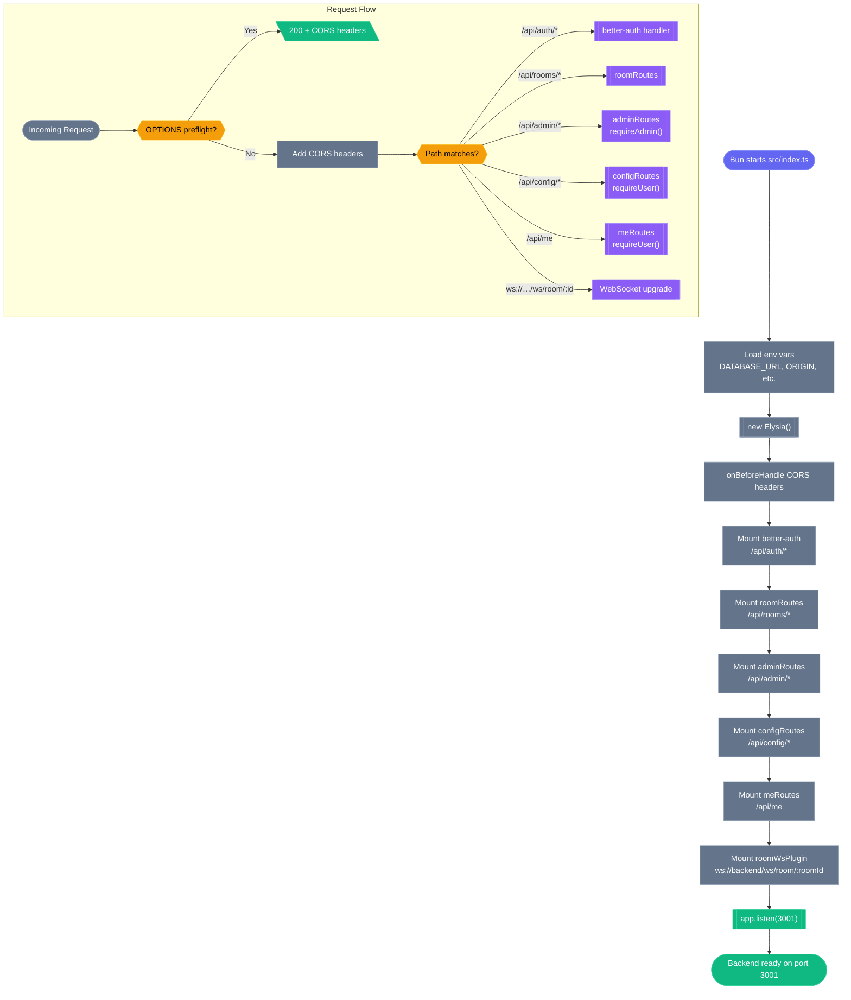

```mermaid
flowchart TD
    A(["Bun starts src/index.ts"]) --> B["Load env vars\nDATABASE_URL, ORIGIN, etc."]
    B --> C[["new Elysia()"]]
    C --> D["onBeforeHandle CORS headers"]
    D --> E["Mount better-auth\n/api/auth/*"]
    E --> F["Mount roomRoutes\n/api/rooms/*"]
    F --> G["Mount adminRoutes\n/api/admin/*"]
    G --> H["Mount configRoutes\n/api/config/*"]
    H --> I["Mount meRoutes\n/api/me"]
    I --> J["Mount roomWsPlugin\nws://backend/ws/room/:roomId"]
    J --> K[["app.listen(3001)"]]
    K --> L(["Backend ready on port 3001"])

    subgraph "Request Flow"
        M(["Incoming Request"]) --> N{{"OPTIONS preflight?"}}
        N -->|Yes| O[\"200 + CORS headers"\]
        N -->|No| P["Add CORS headers"]
        P --> Q{{"Path matches?"}}
        Q -->|"/api/auth/*"| R[["better-auth handler"]]
        Q -->|"/api/rooms/*"| S[["roomRoutes"]]
        Q -->|"/api/admin/*"| T[["adminRoutes\nrequireAdmin()"]]
        Q -->|"/api/config/*"| U[["configRoutes\nrequireUser()"]]
        Q -->|"/api/me"| V[["meRoutes\nrequireUser()"]]
        Q -->|"ws://…/ws/room/:id"| W[["WebSocket upgrade"]]
    end

    classDef entry fill:#6366f1,stroke:#818cf8,color:#fff
    classDef validation fill:#f59e0b,stroke:#fbbf24,color:#000
    classDef success fill:#10b981,stroke:#34d399,color:#fff
    classDef error fill:#ef4444,stroke:#f87171,color:#fff
    classDef external fill:#8b5cf6,stroke:#a78bfa,color:#fff
    classDef processing fill:#64748b,stroke:#94a3b8,color:#fff

    class A,L entry
    class N,Q validation
    class K,L,O success
    class R,S,T,U,V,W external
    class B,C,D,E,F,G,H,I,J,M,P processing
```
