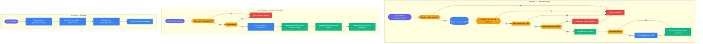

```mermaid
flowchart TD
    subgraph Open ["ws open — Connection Setup"]
        A(["WS Connect /ws/game/:roomId"]) --> B{{"Session cookie present?"}}
        B -->|No| C["Close connection"]
        B -->|Yes| D[(Query session from DB)]
        D --> E{{"Session valid and not expired?"}}
        E -->|No| C
        E -->|Yes| F{{"User connections < 5?"}}
        F -->|No| C
        F -->|Yes| G{{"Game exists for roomId?"}}
        G -->|No| H["Send error: Game not found"]
        H --> C
        G -->|Yes| I["Register wsId in maps"]
        I --> J{{"Spectator mode?"}}
        J -->|Yes| K["Record spectator in DB"]
        J -->|No| L["Send initial game_state snapshot"]
        K --> L
    end

    subgraph Message ["ws message — Action Processing"]
        M(["Incoming WS Message"]) --> N{{"Rate limit: < 30 msgs/min?"}}
        N -->|No| O["Drop message silently"]
        N -->|Yes| P{{"Is spectator?"}}
        P -->|Yes| O
        P -->|No| Q["Parse JSON as GameAction"]
        Q --> R["applyGameAction(roomId, userId, action)"]
        R --> S["broadcastGameState to all clients"]
        S --> T["maybeRunLlmTurn if AI player next"]
    end

    subgraph Close ["ws close — Cleanup"]
        U(["WS Disconnect"]) --> V["Remove from gameSockets map"]
        V --> W["Remove from wsById + wsUserData"]
        W --> X["Remove from userConnections"]
        X --> Y["Clear message timestamps"]
    end

    classDef entry fill:#6366f1,stroke:#818cf8,color:#fff
    classDef validation fill:#f59e0b,stroke:#fbbf24,color:#000
    classDef success fill:#10b981,stroke:#34d399,color:#fff
    classDef error fill:#ef4444,stroke:#f87171,color:#fff
    classDef data fill:#3b82f6,stroke:#60a5fa,color:#fff

    class A,M,U entry
    class B,E,F,G,J,N,P validation
    class I,L,R,S,T success
    class C,H,O error
    class D,K,Q,V,W,X,Y data
```
