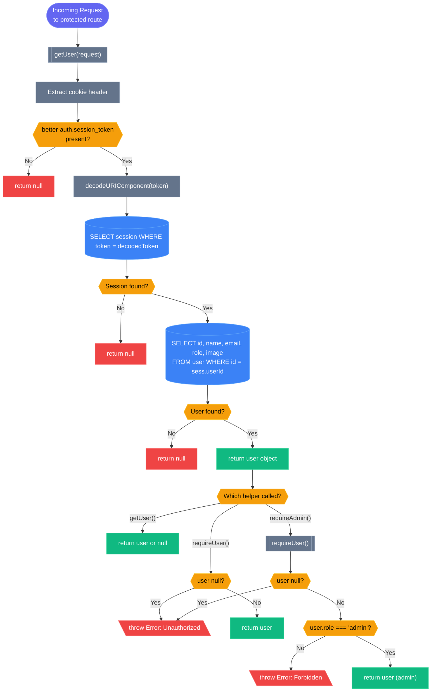

```mermaid
flowchart TD
    A(["Incoming Request\nto protected route"]) --> B[["getUser(request)"]]
    B --> C["Extract cookie header"]
    C --> D{{"better-auth.session_token\npresent?"}}
    D -->|No| E["return null"]
    D -->|Yes| F["decodeURIComponent(token)"]
    F --> G[("SELECT session WHERE token = decodedToken")]
    G --> H{{"Session found?"}}
    H -->|No| I["return null"]
    H -->|Yes| J[("SELECT id, name, email, role, image\nFROM user WHERE id = sess.userId")]
    J --> K{{"User found?"}}
    K -->|No| L["return null"]
    K -->|Yes| M["return user object"]

    M --> N{{"Which helper called?"}}
    N -->|"getUser()"| O["return user or null"]
    N -->|"requireUser()"| P{{"user null?"}}
    P -->|Yes| Q[\"throw Error: Unauthorized"\]
    P -->|No| R["return user"]
    N -->|"requireAdmin()"| S[["requireUser()"]]
    S --> T{{"user null?"}}
    T -->|Yes| Q
    T -->|No| U{{"user.role === 'admin'?"}}
    U -->|No| V[\"throw Error: Forbidden"\]
    U -->|Yes| W["return user (admin)"]

    classDef entry fill:#6366f1,stroke:#818cf8,color:#fff
    classDef validation fill:#f59e0b,stroke:#fbbf24,color:#000
    classDef success fill:#10b981,stroke:#34d399,color:#fff
    classDef error fill:#ef4444,stroke:#f87171,color:#fff
    classDef data fill:#3b82f6,stroke:#60a5fa,color:#fff
    classDef processing fill:#64748b,stroke:#94a3b8,color:#fff

    class A entry
    class D,H,K,N,P,T,U validation
    class M,O,R,W success
    class E,I,L,Q,V error
    class G,J data
    class B,C,F,S processing
```
