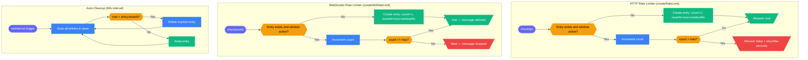

```mermaid
flowchart TD
    subgraph HTTP ["HTTP Rate Limiter (createRateLimit)"]
        A(["check(ip)"]) --> B{{"Entry exists and window active?"}}
        B -->|No| C["Create entry: count=1, resetAt=now+windowMs"]
        C --> D[\Allowed: true/]
        B -->|Yes| E["Increment count"]
        E --> F{{"count > max?"}}
        F -->|No| D
        F -->|Yes| G[\Allowed: false + retryAfter seconds/]
    end

    subgraph WS ["WebSocket Rate Limiter (createWsRateLimit)"]
        H(["check(wsId)"]) --> I{{"Entry exists and window active?"}}
        I -->|No| J["Create entry: count=1, resetAt=now+windowMs"]
        J --> K[\true — message allowed/]
        I -->|Yes| L["Increment count"]
        L --> M{{"count <= max?"}}
        M -->|Yes| K
        M -->|No| N[\false — message dropped/]
    end

    subgraph Cleanup ["Auto-Cleanup (60s interval)"]
        O(["setInterval trigger"]) --> P["Scan all entries in store"]
        P --> Q{{"now > entry.resetAt?"}}
        Q -->|Yes| R["Delete expired entry"]
        Q -->|No| S["Keep entry"]
        R --> P
        S --> P
    end

    classDef entry fill:#6366f1,stroke:#818cf8,color:#fff
    classDef validation fill:#f59e0b,stroke:#fbbf24,color:#000
    classDef success fill:#10b981,stroke:#34d399,color:#fff
    classDef error fill:#ef4444,stroke:#f87171,color:#fff
    classDef data fill:#3b82f6,stroke:#60a5fa,color:#fff

    class A,H,O entry
    class B,F,I,M,Q validation
    class C,D,J,K,S success
    class G,N error
    class E,L,P,R data
```
