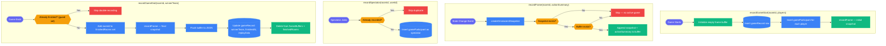

```mermaid
flowchart TD
    subgraph Start ["recordGameStart(roomId, players)"]
        A(["Game Starts"]) --> B["Initialize empty frame buffer"]
        B --> C[(Insert gameRecord row)]
        C --> D["Insert gameParticipant for each player"]
        D --> E["recordFrame — initial snapshot"]
    end

    subgraph Frame ["recordFrame(roomId, actionSummary)"]
        F(["State Change Event"]) --> G["createOmniscientSnapshot"]
        G --> H{{"Snapshot exists?"}}
        H -->|No| I["Skip — no active game"]
        H -->|Yes| J{{"Buffer exists?"}}
        J -->|No| I
        J -->|Yes| K["Append snapshot + actionSummary to buffer"]
    end

    subgraph Spectator ["recordSpectator(roomId, userId)"]
        L(["Spectator Joins"]) --> M{{"Already recorded?"}}
        M -->|Yes| N["Skip duplicate"]
        M -->|No| O[(Insert gameParticipant as spectator)]
    end

    subgraph End ["recordGameEnd(roomId, winnerTeam)"]
        P(["Game Ends"]) --> Q{{"Already finished? (guard set)"}}
        Q -->|Yes| R["Skip double-recording"]
        Q -->|No| S["Add roomId to finishedRooms set"]
        S --> T["recordFrame — final snapshot"]
        T --> U["Flush buffer to JSON"]
        U --> V[(Update gameRecord: winnerTeam, finishedAt, replayData)]
        V --> W["Delete from frameBuffers + finishedRooms"]
    end

    classDef entry fill:#6366f1,stroke:#818cf8,color:#fff
    classDef validation fill:#f59e0b,stroke:#fbbf24,color:#000
    classDef success fill:#10b981,stroke:#34d399,color:#fff
    classDef error fill:#ef4444,stroke:#f87171,color:#fff
    classDef data fill:#3b82f6,stroke:#60a5fa,color:#fff

    class A,F,L,P entry
    class H,J,M,Q validation
    class B,E,K,W success
    class I,N,R error
    class C,D,G,O,S,T,U,V data
```
