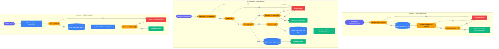

```mermaid
flowchart TD
    subgraph Open ["ws open — Connection Setup"]
        A(["WS Connect /ws/room/:roomId"]) --> B{{"Session cookie present?"}}
        B -->|No| C["Close connection"]
        B -->|Yes| D[(Query session from DB)]
        D --> E{{"Session valid and not expired?"}}
        E -->|No| C
        E -->|Yes| F{{"User connections < 5?"}}
        F -->|No| C
        F -->|Yes| G["Register in maps + broadcastPlayers"]
    end

    subgraph Message ["ws message — Action Routing"]
        H(["Incoming WS Message"]) --> I{{"Rate limit: < 30 msgs/min?"}}
        I -->|No| J["Drop message"]
        I -->|Yes| K{{"Is spectator?"}}
        K -->|Yes| J
        K -->|No| L{{"Message type?"}}
        L -->|chat| M{{"Valid text, <= 500 chars?"}}
        M -->|No| J
        M -->|Yes| N["Broadcast chat to room"]
        L -->|kick| O{{"Sender is host?"}}
        O -->|No| J
        O -->|Yes| P[(Delete target player from DB)]
        P --> Q["Broadcast kicked + broadcastPlayers"]
        L -->|ready| R[(Update player ready status)]
        R --> S["broadcastPlayers"]
    end

    subgraph Close ["ws close — Player Departure"]
        T(["WS Disconnect"]) --> U["Cleanup maps + timestamps"]
        U --> V{{"Was spectator?"}}
        V -->|Yes| W["Done — no roster change"]
        V -->|No| X[(Delete roomPlayer from DB)]
        X --> Y["syncRoomAfterHumanDeparture"]
        Y --> Z{{"Room deleted (empty)?"}}
        Z -->|Yes| W
        Z -->|No| AA["broadcastPlayers"]
    end

    classDef entry fill:#6366f1,stroke:#818cf8,color:#fff
    classDef validation fill:#f59e0b,stroke:#fbbf24,color:#000
    classDef success fill:#10b981,stroke:#34d399,color:#fff
    classDef error fill:#ef4444,stroke:#f87171,color:#fff
    classDef data fill:#3b82f6,stroke:#60a5fa,color:#fff

    class A,H,T entry
    class B,E,F,I,K,L,M,O,V,Z validation
    class G,N,Q,S,AA success
    class C,J,W error
    class D,P,R,X,Y,U data
```
