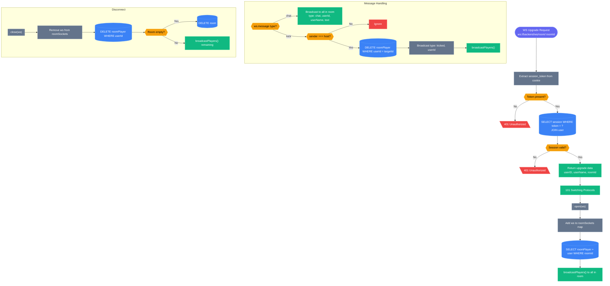

```mermaid
flowchart TD
    A(["WS Upgrade Request\nws://backend/ws/room/:roomId"]) --> B["Extract session_token from cookie"]
    B --> C{{"Token present?"}}
    C -->|No| D[\"401 Unauthorized"\]
    C -->|Yes| E[("SELECT session WHERE token = ?\nJOIN user")]
    E --> F{{"Session valid?"}}
    F -->|No| G[\"401 Unauthorized"\]
    F -->|Yes| H["Return upgrade data\nuserID, userName, roomId"]
    H --> I["101 Switching Protocols"]

    I --> J[["open(ws)"]]
    J --> K["Add ws to roomSockets map"]
    K --> L[("SELECT roomPlayer + user WHERE roomId")]
    L --> M["broadcastPlayers() to all in room"]

    subgraph "Message Handling"
        N{{"ws.message type?"}} -->|"chat"| O["Broadcast to all in room\ntype: chat, userId, userName, text"]
        N -->|"kick"| P{{"sender === host?"}}
        P -->|No| Q["Ignore"]
        P -->|Yes| R[("DELETE roomPlayer WHERE userId = targetId")]
        R --> S["Broadcast type: kicked, userId"]
        S --> T["broadcastPlayers()"]
    end

    subgraph "Disconnect"
        U[["close(ws)"]] --> V["Remove ws from roomSockets"]
        V --> W[("DELETE roomPlayer WHERE userId")]
        W --> X{{"Room empty?"}}
        X -->|Yes| Y[("DELETE room")]
        X -->|No| Z["broadcastPlayers() remaining"]
    end

    classDef entry fill:#6366f1,stroke:#818cf8,color:#fff
    classDef validation fill:#f59e0b,stroke:#fbbf24,color:#000
    classDef success fill:#10b981,stroke:#34d399,color:#fff
    classDef error fill:#ef4444,stroke:#f87171,color:#fff
    classDef data fill:#3b82f6,stroke:#60a5fa,color:#fff
    classDef processing fill:#64748b,stroke:#94a3b8,color:#fff

    class A,I entry
    class C,F,N,P,X validation
    class H,I,M,O,T,Z success
    class D,G,Q error
    class E,L,R,W,Y data
    class B,J,K,S,U,V processing
```
