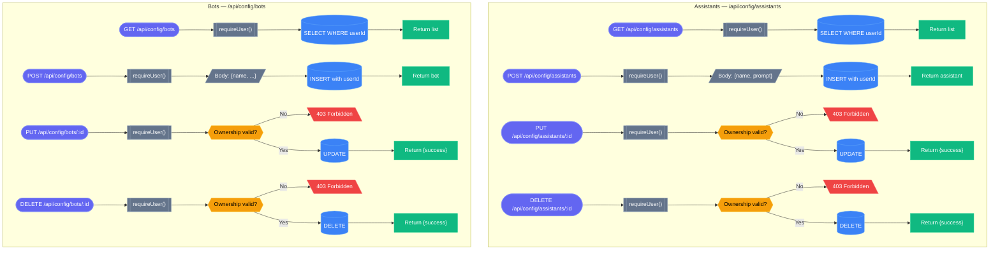

```mermaid
flowchart TD
    subgraph "Assistants — /api/config/assistants"
        A1(["GET /api/config/assistants"]) --> B1[["requireUser()"]]
        B1 --> C1[("SELECT WHERE userId")]
        C1 --> D1["Return list"]

        A2(["POST /api/config/assistants"]) --> B2[["requireUser()"]]
        B2 --> C2[/"Body: {name, prompt}"/]
        C2 --> D2[("INSERT with userId")]
        D2 --> E2["Return assistant"]

        A3(["PUT /api/config/assistants/:id"]) --> B3[["requireUser()"]]
        B3 --> C3{{"Ownership valid?"}}
        C3 -->|No| D3[\"403 Forbidden"\]
        C3 -->|Yes| E3[("UPDATE")]
        E3 --> F3["Return {success}"]

        A4(["DELETE /api/config/assistants/:id"]) --> B4[["requireUser()"]]
        B4 --> C4{{"Ownership valid?"}}
        C4 -->|No| D4[\"403 Forbidden"\]
        C4 -->|Yes| E4[("DELETE")]
        E4 --> F4["Return {success}"]
    end

    subgraph "Bots — /api/config/bots"
        A5(["GET /api/config/bots"]) --> B5[["requireUser()"]]
        B5 --> C5[("SELECT WHERE userId")]
        C5 --> D5["Return list"]

        A6(["POST /api/config/bots"]) --> B6[["requireUser()"]]
        B6 --> C6[/"Body: {name, ...}"/]
        C6 --> D6[("INSERT with userId")]
        D6 --> E6["Return bot"]

        A7(["PUT /api/config/bots/:id"]) --> B7[["requireUser()"]]
        B7 --> C7{{"Ownership valid?"}}
        C7 -->|No| D7[\"403 Forbidden"\]
        C7 -->|Yes| E7[("UPDATE")]
        E7 --> F7["Return {success}"]

        A8(["DELETE /api/config/bots/:id"]) --> B8[["requireUser()"]]
        B8 --> C8{{"Ownership valid?"}}
        C8 -->|No| D8[\"403 Forbidden"\]
        C8 -->|Yes| E8[("DELETE")]
        E8 --> F8["Return {success}"]
    end

    classDef entry fill:#6366f1,stroke:#818cf8,color:#fff
    classDef validation fill:#f59e0b,stroke:#fbbf24,color:#000
    classDef success fill:#10b981,stroke:#34d399,color:#fff
    classDef error fill:#ef4444,stroke:#f87171,color:#fff
    classDef data fill:#3b82f6,stroke:#60a5fa,color:#fff
    classDef processing fill:#64748b,stroke:#94a3b8,color:#fff

    class A1,A2,A3,A4,A5,A6,A7,A8 entry
    class C3,C4,C7,C8 validation
    class D1,E2,F3,F4,D5,E6,F7,F8 success
    class D3,D4,D7,D8 error
    class C1,D2,E3,E4,C5,D6,E7,E8 data
    class B1,B2,B3,B4,B5,B6,B7,B8,C2,C6 processing
```
