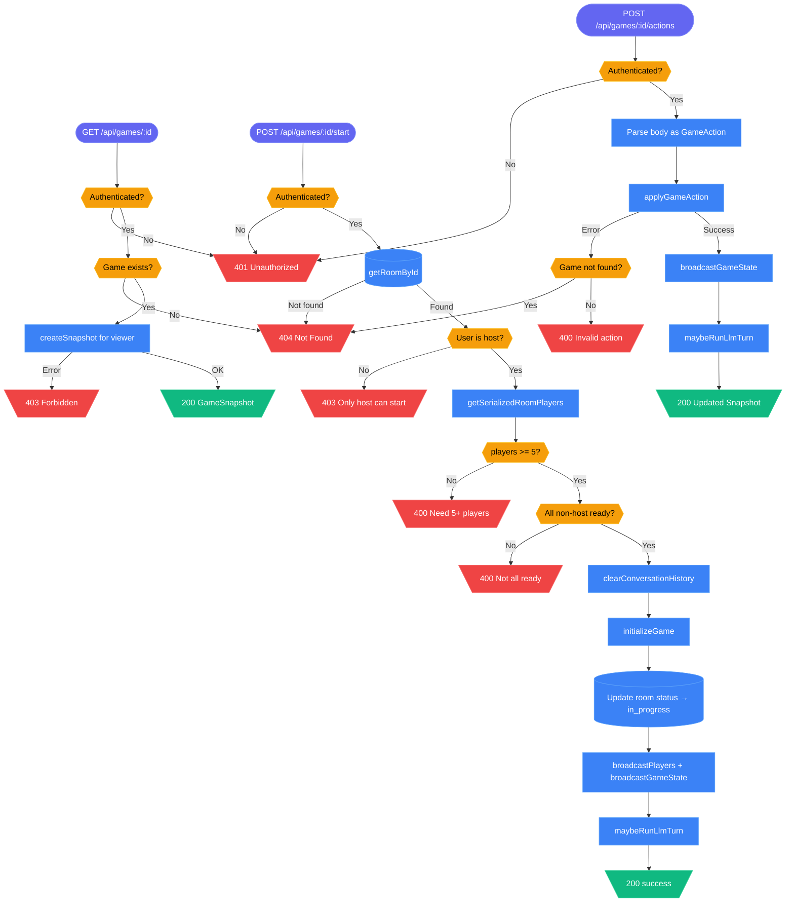

```mermaid
flowchart TD
    A(["GET /api/games/:id"]) --> B{{"Authenticated?"}}
    B -->|No| C[\401 Unauthorized/]
    B -->|Yes| D{{"Game exists?"}}
    D -->|No| E[\404 Not Found/]
    D -->|Yes| F["createSnapshot for viewer"]
    F -->|Error| G[\403 Forbidden/]
    F -->|OK| H[\200 GameSnapshot/]

    I(["POST /api/games/:id/start"]) --> J{{"Authenticated?"}}
    J -->|No| C
    J -->|Yes| K[(getRoomById)]
    K -->|Not found| E
    K -->|Found| L{{"User is host?"}}
    L -->|No| M[\403 Only host can start/]
    L -->|Yes| N["getSerializedRoomPlayers"]
    N --> O{{"players >= 5?"}}
    O -->|No| P[\400 Need 5+ players/]
    O -->|Yes| Q{{"All non-host ready?"}}
    Q -->|No| R[\400 Not all ready/]
    Q -->|Yes| S["clearConversationHistory"]
    S --> T["initializeGame"]
    T --> U[("Update room status → in_progress")]
    U --> V["broadcastPlayers + broadcastGameState"]
    V --> W["maybeRunLlmTurn"]
    W --> X[\200 success/]

    Y(["POST /api/games/:id/actions"]) --> Z{{"Authenticated?"}}
    Z -->|No| C
    Z -->|Yes| AA["Parse body as GameAction"]
    AA --> AB["applyGameAction"]
    AB -->|Error| AC{{"Game not found?"}}
    AC -->|Yes| E
    AC -->|No| AD[\400 Invalid action/]
    AB -->|Success| AE["broadcastGameState"]
    AE --> AF["maybeRunLlmTurn"]
    AF --> AG[\200 Updated Snapshot/]

    classDef entry fill:#6366f1,stroke:#818cf8,color:#fff
    classDef validation fill:#f59e0b,stroke:#fbbf24,color:#000
    classDef success fill:#10b981,stroke:#34d399,color:#fff
    classDef error fill:#ef4444,stroke:#f87171,color:#fff
    classDef data fill:#3b82f6,stroke:#60a5fa,color:#fff

    class A,I,Y entry
    class B,D,J,L,O,Q,Z,AC validation
    class H,X,AG success
    class C,E,G,M,P,R,AD error
    class F,K,N,S,T,U,V,W,AA,AB,AE,AF data
```
