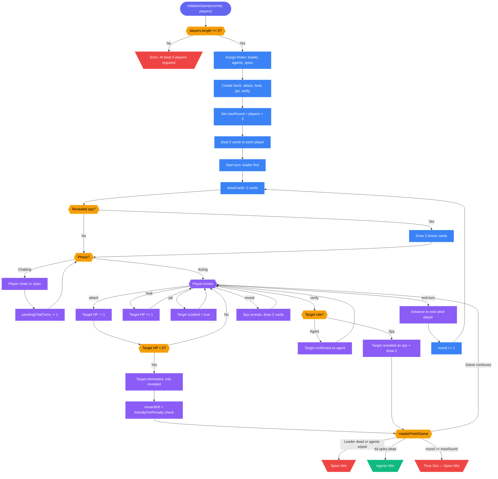

```mermaid
flowchart TD
    A(["initializeGame(roomId, players)"]) --> B{{"players.length >= 5?"}}
    B -->|No| C[\Error: At least 5 players required/]
    B -->|Yes| D["Assign Roles: leader, agents, spies"]
    D --> E["Create Deck: attack, heal, jail, verify"]
    E --> F["Set maxRound = players × 3"]
    F --> G["Deal 2 cards to each player"]
    G --> H["Start turn: leader first"]

    H --> I["drawCards: 2 cards"]
    I --> J{{"Revealed spy?"}}
    J -->|Yes| K["Draw 2 bonus cards"]
    J -->|No| L{{"Phase?"}}
    K --> L

    L -->|Chatting| M["Player chats or skips"]
    M --> N["pendingChatTurns -= 1"]
    N --> L

    L -->|Acting| O{{"Player Action"}}
    O -->|attack| P["Target HP -= 1"]
    O -->|heal| Q["Target HP += 1"]
    O -->|jail| R["Target isJailed = true"]
    O -->|verify| S{{"Target role?"}}
    O -->|reveal| T["Spy reveals, draw 2 cards"]
    O -->|end-turn| U["Advance to next alive player"]

    S -->|Spy| V["Target revealed as spy + draw 2"]
    S -->|Agent| W["Target confirmed as agent"]

    P --> X{{"Target HP = 0?"}}
    X -->|No| O
    X -->|Yes| Y["Target eliminated, role revealed"]
    Y --> Z["rewardKill + friendlyFirePenalty check"]
    Z --> AA{{"maybeFinishGame"}}

    Q --> O
    R --> O
    V --> AA
    W --> O
    T --> O

    AA -->|Leader dead or agents wiped| AB[\Spies Win/]
    AA -->|All spies dead| AC[\Agents Win/]
    AA -->|"round >= maxRound"| AD[\Time Out — Spies Win/]
    AA -->|Game continues| O

    U --> AE["round += 1"]
    AE --> I

    classDef entry fill:#6366f1,stroke:#818cf8,color:#fff
    classDef validation fill:#f59e0b,stroke:#fbbf24,color:#000
    classDef success fill:#10b981,stroke:#34d399,color:#fff
    classDef error fill:#ef4444,stroke:#f87171,color:#fff
    classDef data fill:#3b82f6,stroke:#60a5fa,color:#fff
    classDef action fill:#8b5cf6,stroke:#a78bfa,color:#fff

    class A entry
    class B,J,L,X,AA,S validation
    class AC success
    class C,AB,AD error
    class D,E,F,G,H,I,K,AE data
    class M,N,O,P,Q,R,T,U,V,W,Y,Z action
```
