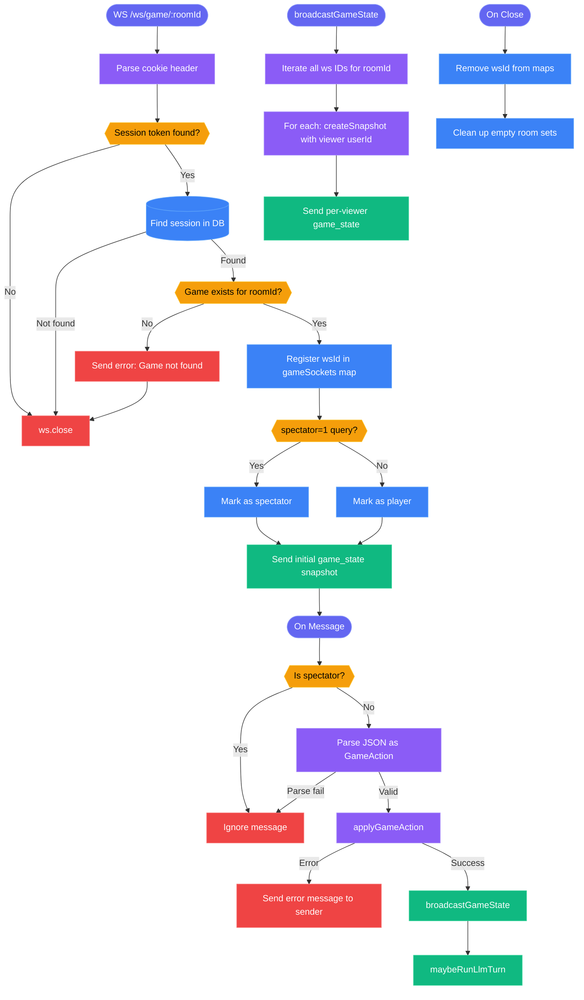

```mermaid
flowchart TD
    A(["WS /ws/game/:roomId"]) --> B["Parse cookie header"]
    B --> C{{"Session token found?"}}
    C -->|No| D["ws.close"]
    C -->|Yes| E[(Find session in DB)]
    E -->|Not found| D
    E -->|Found| F{{"Game exists for roomId?"}}
    F -->|No| G["Send error: Game not found"]
    G --> D
    F -->|Yes| H["Register wsId in gameSockets map"]
    H --> I{{"spectator=1 query?"}}
    I -->|Yes| J["Mark as spectator"]
    I -->|No| K["Mark as player"]
    J --> L["Send initial game_state snapshot"]
    K --> L

    L --> M(["On Message"])
    M --> N{{"Is spectator?"}}
    N -->|Yes| O["Ignore message"]
    N -->|No| P["Parse JSON as GameAction"]
    P -->|Parse fail| O
    P -->|Valid| Q["applyGameAction"]
    Q -->|Error| R["Send error message to sender"]
    Q -->|Success| S["broadcastGameState"]
    S --> T["maybeRunLlmTurn"]

    U(["broadcastGameState"]) --> V["Iterate all ws IDs for roomId"]
    V --> W["For each: createSnapshot with viewer userId"]
    W --> X["Send per-viewer game_state"]

    Y(["On Close"]) --> Z["Remove wsId from maps"]
    Z --> AA["Clean up empty room sets"]

    classDef entry fill:#6366f1,stroke:#818cf8,color:#fff
    classDef validation fill:#f59e0b,stroke:#fbbf24,color:#000
    classDef success fill:#10b981,stroke:#34d399,color:#fff
    classDef error fill:#ef4444,stroke:#f87171,color:#fff
    classDef data fill:#3b82f6,stroke:#60a5fa,color:#fff
    classDef action fill:#8b5cf6,stroke:#a78bfa,color:#fff

    class A,M,U,Y entry
    class C,F,I,N validation
    class L,S,T,X success
    class D,G,O,R error
    class E,H,J,K,Z,AA data
    class B,P,Q,V,W action
```
