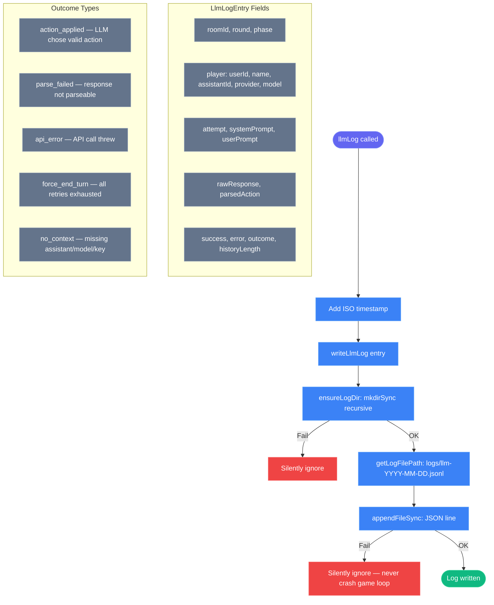

```mermaid
flowchart TD
    A(["llmLog called"]) --> B["Add ISO timestamp"]
    B --> C["writeLlmLog entry"]

    C --> D["ensureLogDir: mkdirSync recursive"]
    D -->|Fail| E["Silently ignore"]
    D -->|OK| F["getLogFilePath: logs/llm-YYYY-MM-DD.jsonl"]
    F --> G["appendFileSync: JSON line"]
    G -->|Fail| H["Silently ignore — never crash game loop"]
    G -->|OK| I([Log written])

    subgraph LlmLogEntry Fields
        J["roomId, round, phase"]
        K["player: userId, name, assistantId, provider, model"]
        L["attempt, systemPrompt, userPrompt"]
        M["rawResponse, parsedAction"]
        N["success, error, outcome, historyLength"]
    end

    subgraph Outcome Types
        O["action_applied — LLM chose valid action"]
        P["parse_failed — response not parseable"]
        Q["api_error — API call threw"]
        R["force_end_turn — all retries exhausted"]
        S["no_context — missing assistant/model/key"]
    end

    classDef entry fill:#6366f1,stroke:#818cf8,color:#fff
    classDef success fill:#10b981,stroke:#34d399,color:#fff
    classDef error fill:#ef4444,stroke:#f87171,color:#fff
    classDef data fill:#3b82f6,stroke:#60a5fa,color:#fff
    classDef info fill:#64748b,stroke:#94a3b8,color:#fff

    class A entry
    class I success
    class E,H error
    class B,C,D,F,G data
    class J,K,L,M,N,O,P,Q,R,S info
```
