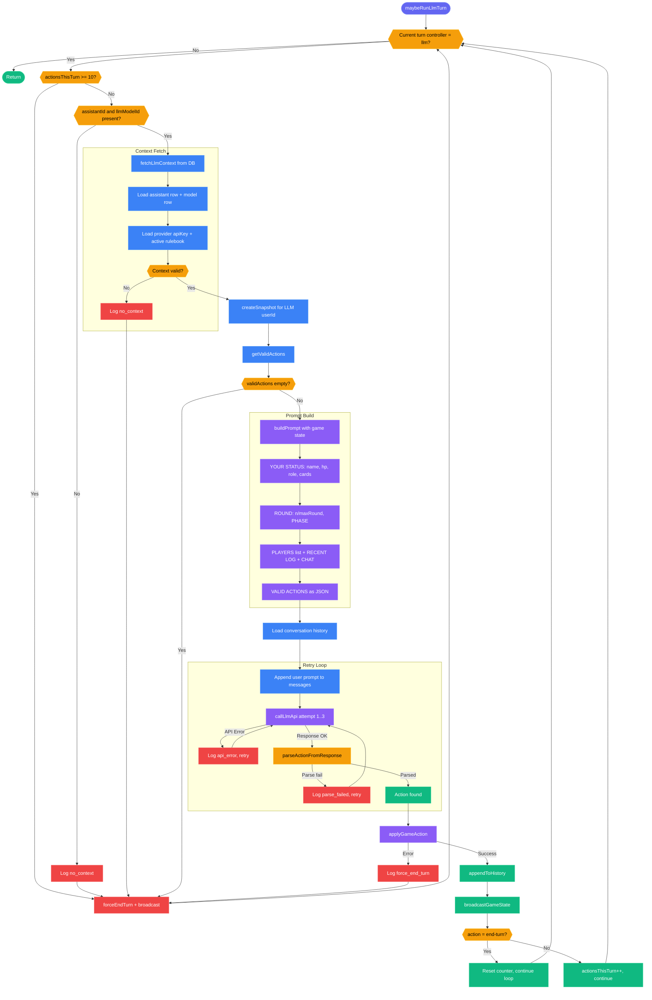

```mermaid
flowchart TD
    A(["maybeRunLlmTurn"]) --> B{{"Current turn controller = llm?"}}
    B -->|No| C([Return])
    B -->|Yes| D{{"actionsThisTurn >= 10?"}}
    D -->|Yes| E["forceEndTurn + broadcast"]
    E --> B
    D -->|No| F{{"assistantId and llmModelId present?"}}
    F -->|No| G["Log no_context"]
    G --> E

    F -->|Yes| H["fetchLlmContext from DB"]

    subgraph Context Fetch
        H --> I["Load assistant row + model row"]
        I --> J["Load provider apiKey + active rulebook"]
        J --> K{{"Context valid?"}}
        K -->|No| L["Log no_context"]
    end

    L --> E
    K -->|Yes| M["createSnapshot for LLM userId"]
    M --> N["getValidActions"]
    N --> O{{"validActions empty?"}}
    O -->|Yes| E
    O -->|No| P["buildPrompt with game state"]

    subgraph Prompt Build
        P --> PA["YOUR STATUS: name, hp, role, cards"]
        PA --> PB["ROUND: n/maxRound, PHASE"]
        PB --> PC["PLAYERS list + RECENT LOG + CHAT"]
        PC --> PD["VALID ACTIONS as JSON"]
    end

    PD --> Q["Load conversation history"]
    Q --> R["Append user prompt to messages"]

    subgraph Retry Loop
        R --> S["callLlmApi attempt 1..3"]
        S -->|API Error| T["Log api_error, retry"]
        S -->|Response OK| U["parseActionFromResponse"]
        U -->|Parse fail| V["Log parse_failed, retry"]
        U -->|Parsed| W["Action found"]
        T --> S
        V --> S
    end

    W --> X["applyGameAction"]
    X -->|Error| Y["Log force_end_turn"]
    Y --> E
    X -->|Success| Z["appendToHistory"]
    Z --> AA["broadcastGameState"]
    AA --> AB{{"action = end-turn?"}}
    AB -->|Yes| AC["Reset counter, continue loop"]
    AC --> B
    AB -->|No| AD["actionsThisTurn++, continue"]
    AD --> B

    classDef entry fill:#6366f1,stroke:#818cf8,color:#fff
    classDef validation fill:#f59e0b,stroke:#fbbf24,color:#000
    classDef success fill:#10b981,stroke:#34d399,color:#fff
    classDef error fill:#ef4444,stroke:#f87171,color:#fff
    classDef data fill:#3b82f6,stroke:#60a5fa,color:#fff
    classDef external fill:#8b5cf6,stroke:#a78bfa,color:#fff

    class A entry
    class B,D,F,K,O,AB validation
    class C,W,Z,AA,AC,AD success
    class G,L,T,V,Y,E error
    class H,I,J,M,N,Q,R data
    class S,X,P,PA,PB,PC,PD external
    class U validation
```
