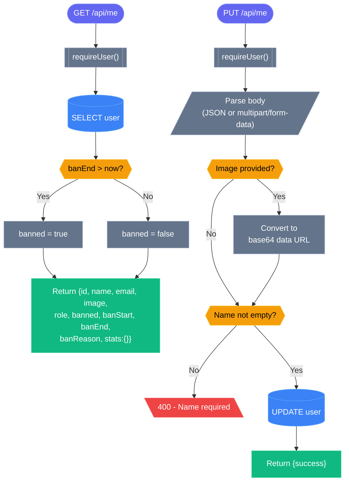

```mermaid
flowchart TD
    A1(["GET /api/me"]) --> B1[["requireUser()"]]
    B1 --> C1[("SELECT user")]
    C1 --> D1{{"banEnd > now?"}}
    D1 -->|Yes| E1["banned = true"]
    D1 -->|No| F1["banned = false"]
    E1 --> G1["Return {id, name, email, image,\nrole, banned, banStart, banEnd,\nbanReason, stats:{}}"]
    F1 --> G1

    A2(["PUT /api/me"]) --> B2[["requireUser()"]]
    B2 --> C2[/"Parse body\n(JSON or multipart/form-data)"/]
    C2 --> D2{{"Image provided?"}}
    D2 -->|Yes| E2["Convert to\nbase64 data URL"]
    D2 -->|No| F2{{"Name not empty?"}}
    E2 --> F2
    F2 -->|No| G2[\"400 - Name required"\]
    F2 -->|Yes| H2[("UPDATE user")]
    H2 --> I2["Return {success}"]

    classDef entry fill:#6366f1,stroke:#818cf8,color:#fff
    classDef validation fill:#f59e0b,stroke:#fbbf24,color:#000
    classDef success fill:#10b981,stroke:#34d399,color:#fff
    classDef error fill:#ef4444,stroke:#f87171,color:#fff
    classDef data fill:#3b82f6,stroke:#60a5fa,color:#fff
    classDef processing fill:#64748b,stroke:#94a3b8,color:#fff

    class A1,A2 entry
    class D1,D2,F2 validation
    class G1,I2 success
    class G2 error
    class C1,H2 data
    class B1,B2,C2,E1,E2,F1 processing
```
