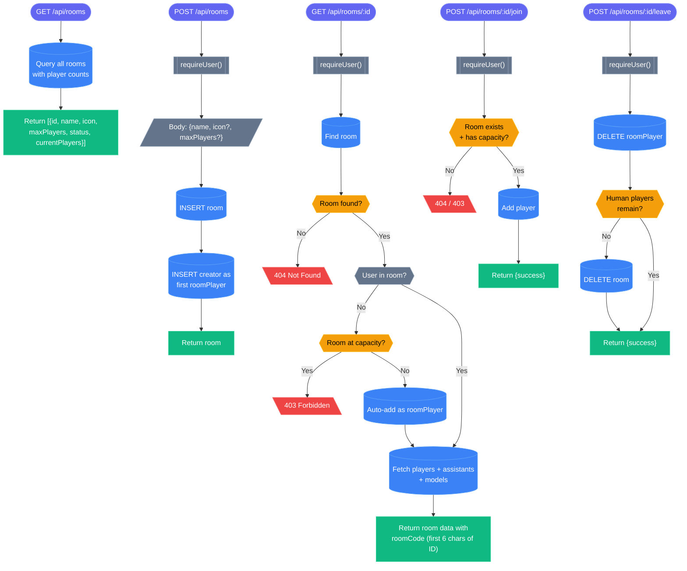

```mermaid
flowchart TD
    A1(["GET /api/rooms"]) --> B1[("Query all rooms\nwith player counts")]
    B1 --> C1["Return [{id, name, icon,\nmaxPlayers, status, currentPlayers}]"]

    A2(["POST /api/rooms"]) --> B2[["requireUser()"]]
    B2 --> C2[/"Body: {name, icon?, maxPlayers?}"/]
    C2 --> D2[("INSERT room")]
    D2 --> E2[("INSERT creator as\nfirst roomPlayer")]
    E2 --> F2["Return room"]

    A3(["GET /api/rooms/:id"]) --> B3[["requireUser()"]]
    B3 --> C3[("Find room")]
    C3 --> D3{{"Room found?"}}
    D3 -->|No| E3[\"404 Not Found"\]
    D3 -->|Yes| F3{{"User in room?"}}
    F3 -->|No| G3{{"Room at capacity?"}}
    G3 -->|Yes| H3[\"403 Forbidden"\]
    G3 -->|No| I3[("Auto-add as roomPlayer")]
    F3 -->|Yes| J3[("Fetch players + assistants\n+ models")]
    I3 --> J3
    J3 --> K3["Return room data with\nroomCode (first 6 chars of ID)"]

    A4(["POST /api/rooms/:id/join"]) --> B4[["requireUser()"]]
    B4 --> C4{{"Room exists\n+ has capacity?"}}
    C4 -->|No| D4[\"404 / 403"\]
    C4 -->|Yes| E4[("Add player")]
    E4 --> F4["Return {success}"]

    A5(["POST /api/rooms/:id/leave"]) --> B5[["requireUser()"]]
    B5 --> C5[("DELETE roomPlayer")]
    C5 --> D5{{"Human players\nremain?"}}
    D5 -->|No| E5[("DELETE room")]
    D5 -->|Yes| F5["Return {success}"]
    E5 --> F5

    classDef entry fill:#6366f1,stroke:#818cf8,color:#fff
    classDef validation fill:#f59e0b,stroke:#fbbf24,color:#000
    classDef success fill:#10b981,stroke:#34d399,color:#fff
    classDef error fill:#ef4444,stroke:#f87171,color:#fff
    classDef data fill:#3b82f6,stroke:#60a5fa,color:#fff
    classDef processing fill:#64748b,stroke:#94a3b8,color:#fff

    class A1,A2,A3,A4,A5 entry
    class D3,F3,G3,C4,D5 validation
    class C1,F2,K3,F4,F5 success
    class E3,H3,D4 error
    class B1,D2,E2,C3,I3,J3,E4,C5,E5 data
    class B2,B3,B4,B5,C2,F3 processing
```
