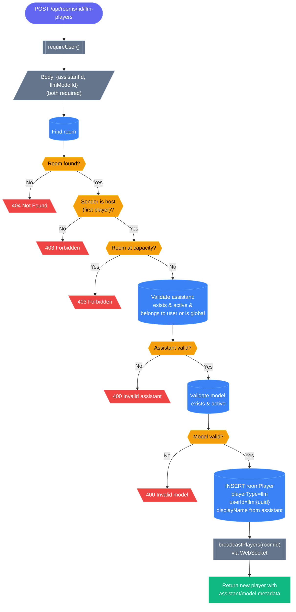

```mermaid
flowchart TD
    A(["POST /api/rooms/:id/llm-players"]) --> B[["requireUser()"]]
    B --> C[/"Body: {assistantId, llmModelId}\n(both required)"/]
    C --> D[("Find room")]
    D --> E{{"Room found?"}}
    E -->|No| F[\"404 Not Found"\]
    E -->|Yes| G{{"Sender is host\n(first player)?"}}
    G -->|No| H[\"403 Forbidden"\]
    G -->|Yes| I{{"Room at capacity?"}}
    I -->|Yes| J[\"403 Forbidden"\]
    I -->|No| K[("Validate assistant:\nexists & active &\nbelongs to user or is global")]
    K --> L{{"Assistant valid?"}}
    L -->|No| M[\"400 Invalid assistant"\]
    L -->|Yes| N[("Validate model:\nexists & active")]
    N --> O{{"Model valid?"}}
    O -->|No| P[\"400 Invalid model"\]
    O -->|Yes| Q[("INSERT roomPlayer\nplayerType=llm\nuserId=llm:{uuid}\ndisplayName from assistant")]
    Q --> R[["broadcastPlayers(roomId)\nvia WebSocket"]]
    R --> S["Return new player with\nassistant/model metadata"]

    classDef entry fill:#6366f1,stroke:#818cf8,color:#fff
    classDef validation fill:#f59e0b,stroke:#fbbf24,color:#000
    classDef success fill:#10b981,stroke:#34d399,color:#fff
    classDef error fill:#ef4444,stroke:#f87171,color:#fff
    classDef data fill:#3b82f6,stroke:#60a5fa,color:#fff
    classDef processing fill:#64748b,stroke:#94a3b8,color:#fff

    class A entry
    class E,G,I,L,O validation
    class S success
    class F,H,J,M,P error
    class D,K,N,Q data
    class B,C,R processing
```
