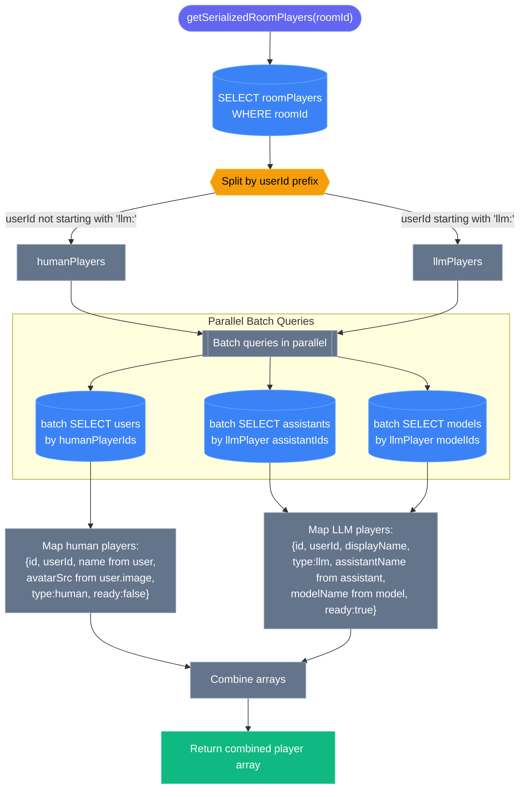

```mermaid
flowchart TD
    A(["getSerializedRoomPlayers(roomId)"]) --> B[("SELECT roomPlayers\nWHERE roomId")]
    B --> C{{"Split by userId prefix"}}
    C -->|"userId not starting with 'llm:'"| D["humanPlayers"]
    C -->|"userId starting with 'llm:'"| E["llmPlayers"]

    D --> F[["Batch queries in parallel"]]
    E --> F

    subgraph "Parallel Batch Queries"
        F --> G[("batch SELECT users\nby humanPlayerIds")]
        F --> H[("batch SELECT assistants\nby llmPlayer assistantIds")]
        F --> I[("batch SELECT models\nby llmPlayer modelIds")]
    end

    G --> J["Map human players:\n{id, userId, name from user,\navatarSrc from user.image,\ntype:human, ready:false}"]
    H --> K["Map LLM players:\n{id, userId, displayName,\ntype:llm, assistantName from assistant,\nmodelName from model, ready:true}"]
    I --> K

    J --> L["Combine arrays"]
    K --> L
    L --> M["Return combined player array"]

    classDef entry fill:#6366f1,stroke:#818cf8,color:#fff
    classDef validation fill:#f59e0b,stroke:#fbbf24,color:#000
    classDef success fill:#10b981,stroke:#34d399,color:#fff
    classDef data fill:#3b82f6,stroke:#60a5fa,color:#fff
    classDef processing fill:#64748b,stroke:#94a3b8,color:#fff

    class A entry
    class C validation
    class M success
    class B,G,H,I data
    class D,E,F,J,K,L processing
```
