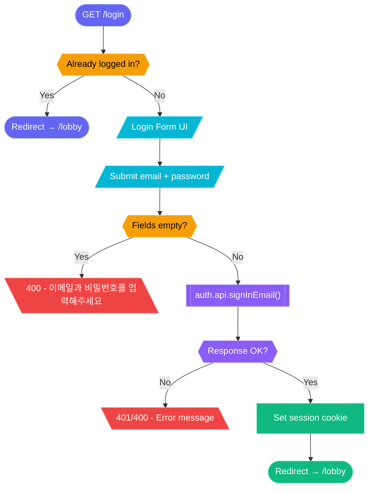

```mermaid
flowchart TD
    A(["GET /login"]) --> B{{"Already logged in?"}}
    B -->|Yes| C(["Redirect → /lobby"])
    B -->|No| D[/Login Form UI/]
    D --> E[/Submit email + password/]
    E --> F{{"Fields empty?"}}
    F -->|Yes| G[\"400 - 이메일과 비밀번호를 입력해주세요"\]
    F -->|No| H[["auth.api.signInEmail()"]]
    H --> I{{"Response OK?"}}
    I -->|No| J[\"401/400 - Error message"\]
    I -->|Yes| K["Set session cookie"]
    K --> L(["Redirect → /lobby"])

    classDef entry fill:#6366f1,stroke:#818cf8,color:#fff
    classDef validation fill:#f59e0b,stroke:#fbbf24,color:#000
    classDef success fill:#10b981,stroke:#34d399,color:#fff
    classDef error fill:#ef4444,stroke:#f87171,color:#fff
    classDef external fill:#8b5cf6,stroke:#a78bfa,color:#fff
    classDef user fill:#06b6d4,stroke:#22d3ee,color:#fff

    class A,C,L entry
    class B,F validation
    class K,L success
    class G,J error
    class H,I external
    class D,E user
```
