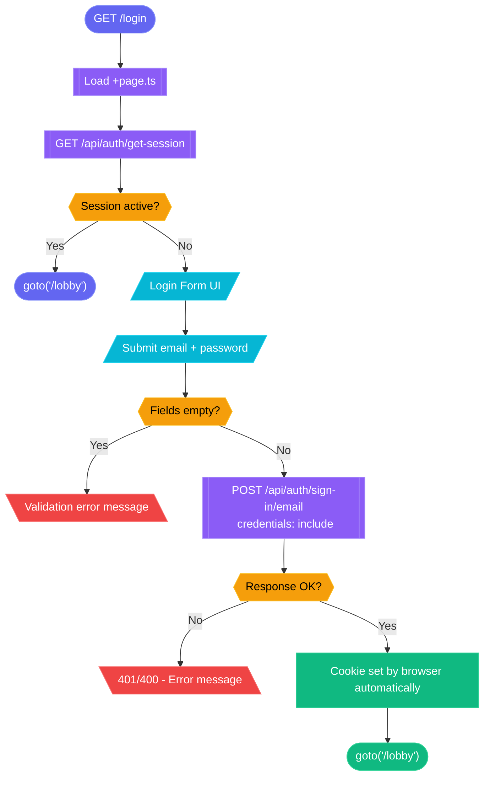

```mermaid
flowchart TD
    A(["GET /login"]) --> B[["Load +page.ts"]]
    B --> C[["GET /api/auth/get-session"]]
    C --> D{{"Session active?"}}
    D -->|Yes| E(["goto('/lobby')"])
    D -->|No| F[/Login Form UI/]
    F --> G[/Submit email + password/]
    G --> H{{"Fields empty?"}}
    H -->|Yes| I[\"Validation error message"\]
    H -->|No| J[["POST /api/auth/sign-in/email\n credentials: include"]]
    J --> K{{"Response OK?"}}
    K -->|No| L[\"401/400 - Error message"\]
    K -->|Yes| M["Cookie set by browser automatically"]
    M --> N(["goto('/lobby')"])

    classDef entry fill:#6366f1,stroke:#818cf8,color:#fff
    classDef validation fill:#f59e0b,stroke:#fbbf24,color:#000
    classDef success fill:#10b981,stroke:#34d399,color:#fff
    classDef error fill:#ef4444,stroke:#f87171,color:#fff
    classDef external fill:#8b5cf6,stroke:#a78bfa,color:#fff
    classDef user fill:#06b6d4,stroke:#22d3ee,color:#fff

    class A,E,N entry
    class D,H,K validation
    class M,N success
    class I,L error
    class B,C,J external
    class F,G user
```
