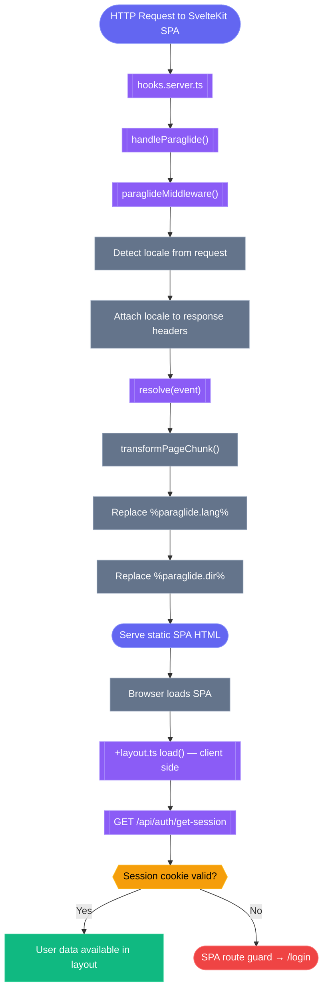

```mermaid
flowchart TD
    A(["HTTP Request to SvelteKit SPA"]) --> B[["hooks.server.ts"]]
    B --> C[["handleParaglide()"]]
    C --> D[["paraglideMiddleware()"]]
    D --> E["Detect locale from request"]
    E --> F["Attach locale to response headers"]
    F --> G[["resolve(event)"]]
    G --> H["transformPageChunk()"]
    H --> I["Replace %paraglide.lang%"]
    I --> J["Replace %paraglide.dir%"]
    J --> K(["Serve static SPA HTML"])

    K --> L["Browser loads SPA"]
    L --> M[["+layout.ts load() — client side"]]
    M --> N[["GET /api/auth/get-session"]]
    N --> O{{"Session cookie valid?"}}
    O -->|Yes| P["User data available in layout"]
    O -->|No| Q(["SPA route guard → /login"])

    classDef entry fill:#6366f1,stroke:#818cf8,color:#fff
    classDef validation fill:#f59e0b,stroke:#fbbf24,color:#000
    classDef success fill:#10b981,stroke:#34d399,color:#fff
    classDef error fill:#ef4444,stroke:#f87171,color:#fff
    classDef external fill:#8b5cf6,stroke:#a78bfa,color:#fff
    classDef processing fill:#64748b,stroke:#94a3b8,color:#fff

    class A,K,Q entry
    class O validation
    class P success
    class Q error
    class B,C,D,G,M,N external
    class E,F,H,I,J,L processing
```
