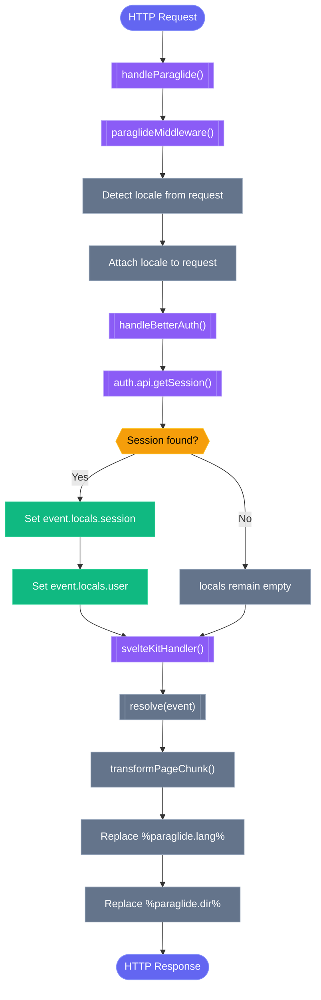

```mermaid
flowchart TD
    A(["HTTP Request"]) --> B[["handleParaglide()"]]
    B --> C[["paraglideMiddleware()"]]
    C --> D["Detect locale from request"]
    D --> E["Attach locale to request"]
    E --> F[["handleBetterAuth()"]]
    F --> G[["auth.api.getSession()"]]
    G --> H{{"Session found?"}}
    H -->|Yes| I["Set event.locals.session"]
    I --> J["Set event.locals.user"]
    H -->|No| K["locals remain empty"]
    J --> L[["svelteKitHandler()"]]
    K --> L
    L --> M[["resolve(event)"]]
    M --> N["transformPageChunk()"]
    N --> O["Replace %paraglide.lang%"]
    O --> P["Replace %paraglide.dir%"]
    P --> Q(["HTTP Response"])

    classDef entry fill:#6366f1,stroke:#818cf8,color:#fff
    classDef validation fill:#f59e0b,stroke:#fbbf24,color:#000
    classDef success fill:#10b981,stroke:#34d399,color:#fff
    classDef external fill:#8b5cf6,stroke:#a78bfa,color:#fff
    classDef processing fill:#64748b,stroke:#94a3b8,color:#fff

    class A,Q entry
    class H validation
    class I,J success
    class B,C,F,G,L external
    class D,E,K,M,N,O,P processing
```
