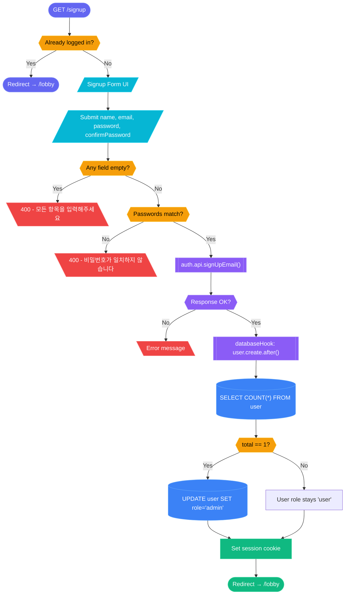

```mermaid
flowchart TD
    A(["GET /signup"]) --> B{{"Already logged in?"}}
    B -->|Yes| C(["Redirect → /lobby"])
    B -->|No| D[/Signup Form UI/]
    D --> E[/"Submit name, email, password, confirmPassword"/]
    E --> F{{"Any field empty?"}}
    F -->|Yes| G[\"400 - 모든 항목을 입력해주세요"\]
    F -->|No| H{{"Passwords match?"}}
    H -->|No| I[\"400 - 비밀번호가 일치하지 않습니다"\]
    H -->|Yes| J[["auth.api.signUpEmail()"]]
    J --> K{{"Response OK?"}}
    K -->|No| L[\"Error message"\]
    K -->|Yes| M[["databaseHook: user.create.after()"]]
    M --> N[("SELECT COUNT(*) FROM user")]
    N --> O{{"total == 1?"}}
    O -->|Yes| P[("UPDATE user SET role='admin'")]
    O -->|No| Q["User role stays 'user'"]
    P --> R["Set session cookie"]
    Q --> R
    R --> S(["Redirect → /lobby"])

    classDef entry fill:#6366f1,stroke:#818cf8,color:#fff
    classDef validation fill:#f59e0b,stroke:#fbbf24,color:#000
    classDef success fill:#10b981,stroke:#34d399,color:#fff
    classDef error fill:#ef4444,stroke:#f87171,color:#fff
    classDef external fill:#8b5cf6,stroke:#a78bfa,color:#fff
    classDef data fill:#3b82f6,stroke:#60a5fa,color:#fff
    classDef user fill:#06b6d4,stroke:#22d3ee,color:#fff

    class A,C,S entry
    class B,F,H,O validation
    class R,S success
    class G,I,L error
    class J,K,M external
    class N,P data
    class D,E user
    class Q processing
```
