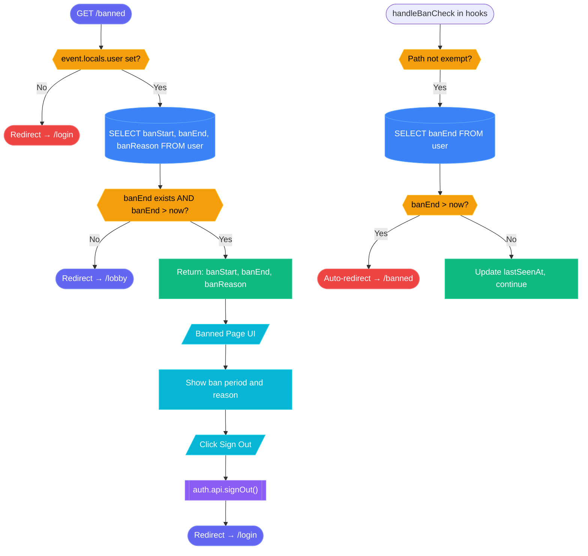

```mermaid
flowchart TD
    A(["GET /banned"]) --> B{{"event.locals.user set?"}}
    B -->|No| C(["Redirect → /login"])
    B -->|Yes| D[("SELECT banStart, banEnd, banReason FROM user")]
    D --> E{{"banEnd exists AND banEnd > now?"}}
    E -->|No| F(["Redirect → /lobby"])
    E -->|Yes| G["Return: banStart, banEnd, banReason"]
    G --> H[/Banned Page UI/]
    H --> I["Show ban period and reason"]
    I --> J[/Click Sign Out/]
    J --> K[["auth.api.signOut()"]]
    K --> L(["Redirect → /login"])

    M(["handleBanCheck in hooks"]) --> N{{"Path not exempt?"}}
    N -->|Yes| O[("SELECT banEnd FROM user")]
    O --> P{{"banEnd > now?"}}
    P -->|Yes| Q(["Auto-redirect → /banned"])
    P -->|No| R["Update lastSeenAt, continue"]

    classDef entry fill:#6366f1,stroke:#818cf8,color:#fff
    classDef validation fill:#f59e0b,stroke:#fbbf24,color:#000
    classDef success fill:#10b981,stroke:#34d399,color:#fff
    classDef error fill:#ef4444,stroke:#f87171,color:#fff
    classDef external fill:#8b5cf6,stroke:#a78bfa,color:#fff
    classDef data fill:#3b82f6,stroke:#60a5fa,color:#fff
    classDef user fill:#06b6d4,stroke:#22d3ee,color:#fff

    class A,C,F,L,Q entry
    class B,E,N,P validation
    class G,R success
    class C,Q error
    class K external
    class D,O data
    class H,I,J user
```
