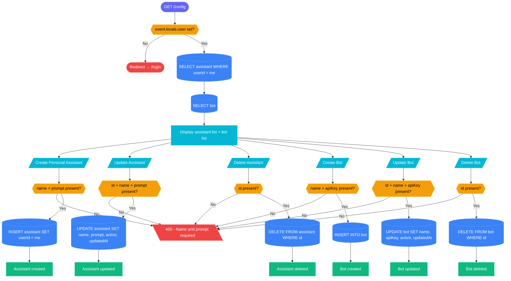

```mermaid
flowchart TD
    A(["GET /config"]) --> B{{"event.locals.user set?"}}
    B -->|No| C(["Redirect → /login"])
    B -->|Yes| D[("SELECT assistant WHERE userId = me")]
    D --> E[("SELECT bot")]
    E --> F["Display assistant list + bot list"]

    F --> G[/"Create Personal Assistant"/]
    G --> H{{"name + prompt present?"}}
    H -->|No| I[\"400 - Name and prompt required"\]
    H -->|Yes| J[("INSERT assistant SET userId = me")]
    J --> K["Assistant created"]

    F --> L[/"Update Assistant"/]
    L --> M{{"id + name + prompt present?"}}
    M -->|No| I
    M -->|Yes| N[("UPDATE assistant SET name, prompt, active, updatedAt")]
    N --> O["Assistant updated"]

    F --> P[/"Delete Assistant"/]
    P --> Q{{"id present?"}}
    Q -->|No| I
    Q -->|Yes| R[("DELETE FROM assistant WHERE id")]
    R --> S["Assistant deleted"]

    F --> T[/"Create Bot"/]
    T --> U{{"name + apiKey present?"}}
    U -->|No| I
    U -->|Yes| V[("INSERT INTO bot")]
    V --> W["Bot created"]

    F --> X[/"Update Bot"/]
    X --> Y{{"id + name + apiKey present?"}}
    Y -->|No| I
    Y -->|Yes| Z[("UPDATE bot SET name, apiKey, active, updatedAt")]
    Z --> AA["Bot updated"]

    F --> AB[/"Delete Bot"/]
    AB --> AC{{"id present?"}}
    AC -->|No| I
    AC -->|Yes| AD[("DELETE FROM bot WHERE id")]
    AD --> AE["Bot deleted"]

    classDef entry fill:#6366f1,stroke:#818cf8,color:#fff
    classDef validation fill:#f59e0b,stroke:#fbbf24,color:#000
    classDef success fill:#10b981,stroke:#34d399,color:#fff
    classDef error fill:#ef4444,stroke:#f87171,color:#fff
    classDef data fill:#3b82f6,stroke:#60a5fa,color:#fff
    classDef user fill:#06b6d4,stroke:#22d3ee,color:#fff

    class A entry
    class B,H,M,Q,U,Y,AC validation
    class K,O,S,W,AA,AE success
    class C,I error
    class D,E,J,N,R,V,Z,AD data
    class F,G,L,P,T,X,AB user
```
