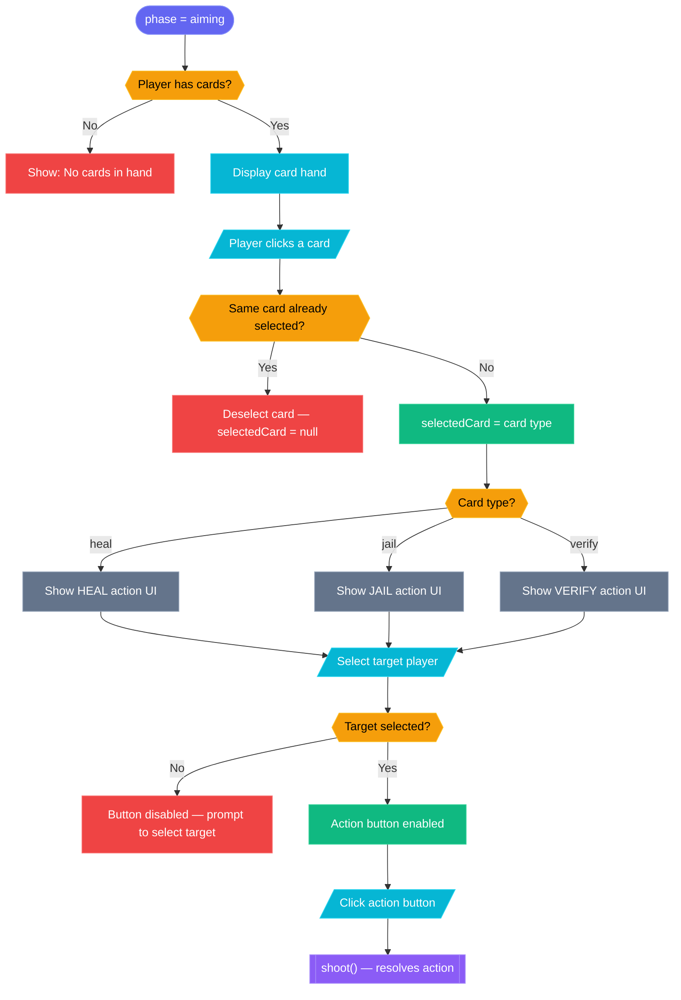

```mermaid
flowchart TD
    A(["phase = aiming"]) --> B{{"Player has cards?"}}
    B -->|No| C["Show: No cards in hand"]
    B -->|Yes| D["Display card hand"]
    D --> E[/Player clicks a card/]
    E --> F{{"Same card already selected?"}}
    F -->|Yes| G["Deselect card — selectedCard = null"]
    F -->|No| H["selectedCard = card type"]
    H --> I{{"Card type?"}}
    I -->|heal| J["Show HEAL action UI"]
    I -->|jail| K["Show JAIL action UI"]
    I -->|verify| L["Show VERIFY action UI"]
    J --> M[/Select target player/]
    K --> M
    L --> M
    M --> N{{"Target selected?"}}
    N -->|No| O["Button disabled — prompt to select target"]
    N -->|Yes| P["Action button enabled"]
    P --> Q[/Click action button/]
    Q --> R[["shoot() — resolves action"]]

    classDef entry fill:#6366f1,stroke:#818cf8,color:#fff
    classDef validation fill:#f59e0b,stroke:#fbbf24,color:#000
    classDef success fill:#10b981,stroke:#34d399,color:#fff
    classDef error fill:#ef4444,stroke:#f87171,color:#fff
    classDef user fill:#06b6d4,stroke:#22d3ee,color:#fff
    classDef processing fill:#64748b,stroke:#94a3b8,color:#fff
    classDef external fill:#8b5cf6,stroke:#a78bfa,color:#fff

    class A entry
    class B,F,I,N validation
    class H,P success
    class C,G,O error
    class D,E,M,Q user
    class J,K,L processing
    class R external
```
