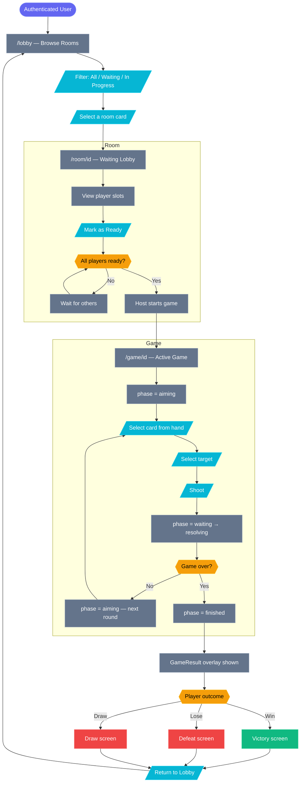

```mermaid
flowchart TD
    A(["Authenticated User"]) --> B["/lobby — Browse Rooms"]
    B --> C[/Filter: All / Waiting / In Progress/]
    C --> D[/Select a room card/]
    D --> E["/room/id — Waiting Lobby"]

    subgraph Room
        E --> F["View player slots"]
        F --> G[/Mark as Ready/]
        G --> H{{"All players ready?"}}
        H -->|No| I["Wait for others"]
        I --> H
        H -->|Yes| J["Host starts game"]
    end

    J --> K["/game/id — Active Game"]

    subgraph Game
        K --> L["phase = aiming"]
        L --> M[/Select card from hand/]
        M --> N[/Select target/]
        N --> O[/Shoot/]
        O --> P["phase = waiting → resolving"]
        P --> Q{{"Game over?"}}
        Q -->|No| R["phase = aiming — next round"]
        R --> M
        Q -->|Yes| S["phase = finished"]
    end

    S --> T["GameResult overlay shown"]
    T --> U{{"Player outcome"}}
    U -->|Win| V["Victory screen"]
    U -->|Lose| W["Defeat screen"]
    U -->|Draw| X["Draw screen"]
    V --> Y[/Return to Lobby/]
    W --> Y
    X --> Y
    Y --> B

    classDef entry fill:#6366f1,stroke:#818cf8,color:#fff
    classDef validation fill:#f59e0b,stroke:#fbbf24,color:#000
    classDef success fill:#10b981,stroke:#34d399,color:#fff
    classDef error fill:#ef4444,stroke:#f87171,color:#fff
    classDef user fill:#06b6d4,stroke:#22d3ee,color:#fff
    classDef processing fill:#64748b,stroke:#94a3b8,color:#fff

    class A entry
    class H,Q,U validation
    class V success
    class W,X error
    class B,K,T processing
    class C,D,G,M,N,O,Y user
    class E,F,I,J,L,P,R,S processing
```
