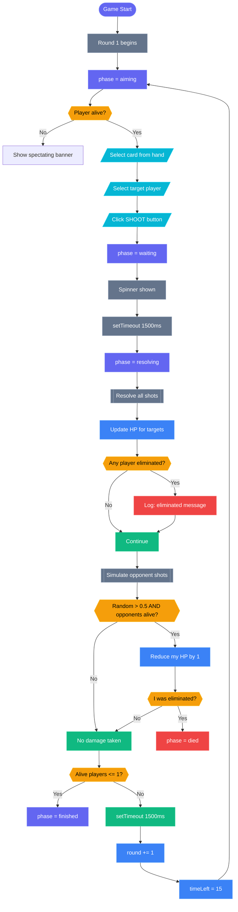

```mermaid
flowchart TD
    A(["Game Start"]) --> B["Round 1 begins"]
    B --> C["phase = aiming"]
    C --> D{{"Player alive?"}}
    D -->|No| E["Show spectating banner"]
    D -->|Yes| F[/Select card from hand/]
    F --> G[/Select target player/]
    G --> H[/Click SHOOT button/]
    H --> I["phase = waiting"]
    I --> J["Spinner shown"]
    J --> K["setTimeout 1500ms"]
    K --> L["phase = resolving"]
    L --> M[["Resolve all shots"]]
    M --> N["Update HP for targets"]
    N --> O{{"Any player eliminated?"}}
    O -->|Yes| P["Log: eliminated message"]
    O -->|No| Q["Continue"]
    P --> Q
    Q --> R[["Simulate opponent shots"]]
    R --> S{{"Random > 0.5 AND opponents alive?"}}
    S -->|Yes| T["Reduce my HP by 1"]
    S -->|No| U["No damage taken"]
    T --> V{{"I was eliminated?"}}
    V -->|Yes| W["phase = died"]
    V -->|No| U
    U --> X{{"Alive players <= 1?"}}
    X -->|Yes| Y["phase = finished"]
    X -->|No| Z["setTimeout 1500ms"]
    Z --> AA["round += 1"]
    AA --> AB["timeLeft = 15"]
    AB --> C

    classDef entry fill:#6366f1,stroke:#818cf8,color:#fff
    classDef validation fill:#f59e0b,stroke:#fbbf24,color:#000
    classDef success fill:#10b981,stroke:#34d399,color:#fff
    classDef error fill:#ef4444,stroke:#f87171,color:#fff
    classDef processing fill:#64748b,stroke:#94a3b8,color:#fff
    classDef user fill:#06b6d4,stroke:#22d3ee,color:#fff
    classDef data fill:#3b82f6,stroke:#60a5fa,color:#fff

    class A,Y entry
    class C,I,L,W,Y entry
    class D,O,S,V,X validation
    class M,R processing
    class F,G,H user
    class N,T,AA,AB data
    class P,W error
    class Q,U,Z success
    class B,J,K processing
```
