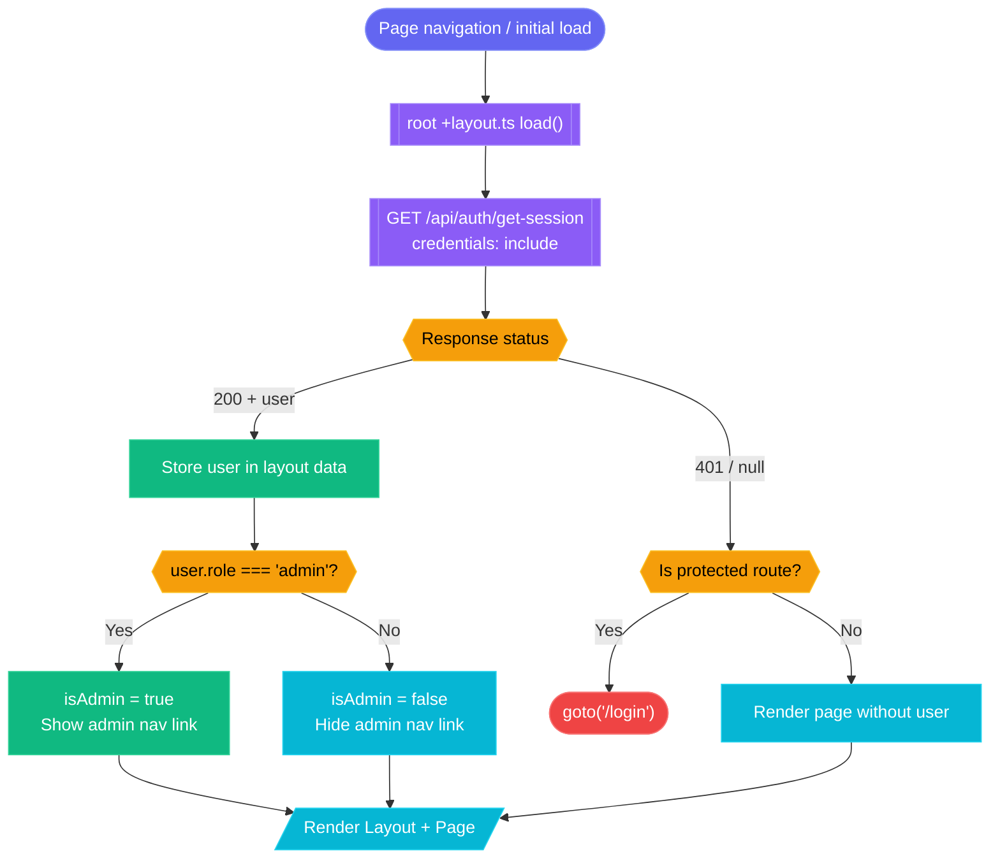

```mermaid
flowchart TD
    A(["Page navigation / initial load"]) --> B[["root +layout.ts load()"]]
    B --> C[["GET /api/auth/get-session\n credentials: include"]]
    C --> D{{"Response status"}}
    D -->|"200 + user"| E["Store user in layout data"]
    D -->|"401 / null"| F{{"Is protected route?"}}
    F -->|Yes| G(["goto('/login')"])
    F -->|No| H["Render page without user"]
    E --> I{{"user.role === 'admin'?"}}
    I -->|Yes| J["isAdmin = true\nShow admin nav link"]
    I -->|No| K["isAdmin = false\nHide admin nav link"]
    J --> L[/Render Layout + Page/]
    K --> L
    H --> L

    classDef entry fill:#6366f1,stroke:#818cf8,color:#fff
    classDef validation fill:#f59e0b,stroke:#fbbf24,color:#000
    classDef success fill:#10b981,stroke:#34d399,color:#fff
    classDef error fill:#ef4444,stroke:#f87171,color:#fff
    classDef external fill:#8b5cf6,stroke:#a78bfa,color:#fff
    classDef user fill:#06b6d4,stroke:#22d3ee,color:#fff

    class A,G entry
    class D,F,I validation
    class E,J,L success
    class G error
    class B,C external
    class H,K,L user
```
