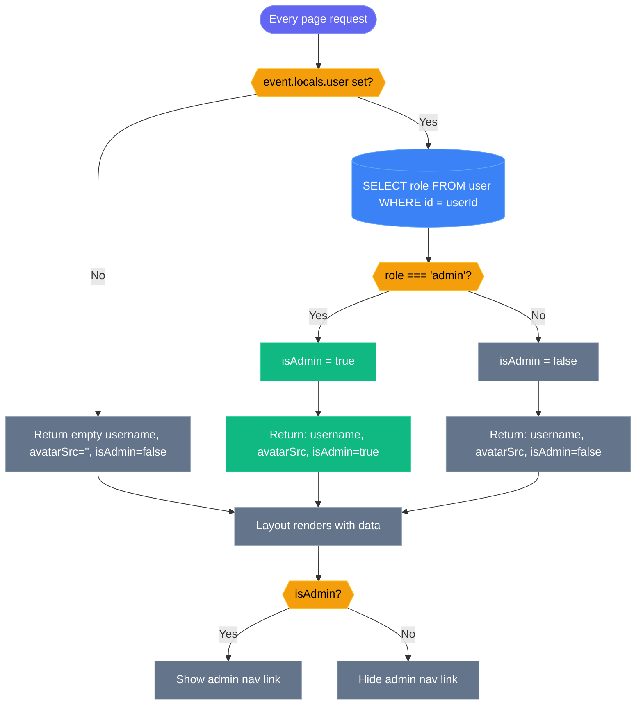

```mermaid
flowchart TD
    A(["Every page request"]) --> B{{"event.locals.user set?"}}
    B -->|No| C["Return empty username, avatarSrc='', isAdmin=false"]
    B -->|Yes| D[("SELECT role FROM user WHERE id = userId")]
    D --> E{{"role === 'admin'?"}}
    E -->|Yes| F["isAdmin = true"]
    E -->|No| G["isAdmin = false"]
    F --> H["Return: username, avatarSrc, isAdmin=true"]
    G --> I["Return: username, avatarSrc, isAdmin=false"]
    C --> J["Layout renders with data"]
    H --> J
    I --> J
    J --> K{{"isAdmin?"}}
    K -->|Yes| L["Show admin nav link"]
    K -->|No| M["Hide admin nav link"]

    classDef entry fill:#6366f1,stroke:#818cf8,color:#fff
    classDef validation fill:#f59e0b,stroke:#fbbf24,color:#000
    classDef success fill:#10b981,stroke:#34d399,color:#fff
    classDef data fill:#3b82f6,stroke:#60a5fa,color:#fff
    classDef processing fill:#64748b,stroke:#94a3b8,color:#fff

    class A entry
    class B,E,K validation
    class F,H success
    class D data
    class C,G,I,J,L,M processing
```
