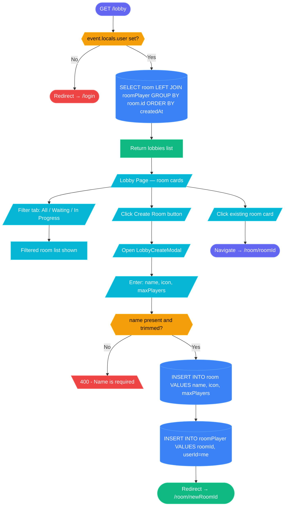

```mermaid
flowchart TD
    A(["GET /lobby"]) --> B{{"event.locals.user set?"}}
    B -->|No| C(["Redirect → /login"])
    B -->|Yes| D[("SELECT room LEFT JOIN roomPlayer GROUP BY room.id ORDER BY createdAt")]
    D --> E["Return lobbies list"]
    E --> F[/Lobby Page — room cards/]

    F --> G[/Filter tab: All / Waiting / In Progress/]
    G --> H["Filtered room list shown"]

    F --> I[/Click Create Room button/]
    I --> J[/Open LobbyCreateModal/]
    J --> K[/"Enter: name, icon, maxPlayers"/]
    K --> L{{"name present and trimmed?"}}
    L -->|No| M[\"400 - Name is required"\]
    L -->|Yes| N[("INSERT INTO room VALUES name, icon, maxPlayers")]
    N --> O[("INSERT INTO roomPlayer VALUES roomId, userId=me")]
    O --> P(["Redirect → /room/newRoomId"])

    F --> Q[/Click existing room card/]
    Q --> R(["Navigate → /room/roomId"])

    classDef entry fill:#6366f1,stroke:#818cf8,color:#fff
    classDef validation fill:#f59e0b,stroke:#fbbf24,color:#000
    classDef success fill:#10b981,stroke:#34d399,color:#fff
    classDef error fill:#ef4444,stroke:#f87171,color:#fff
    classDef data fill:#3b82f6,stroke:#60a5fa,color:#fff
    classDef user fill:#06b6d4,stroke:#22d3ee,color:#fff

    class A,C,P,R entry
    class B,L validation
    class E,P success
    class C,M error
    class D,N,O data
    class F,G,H,I,J,K,Q user
```
