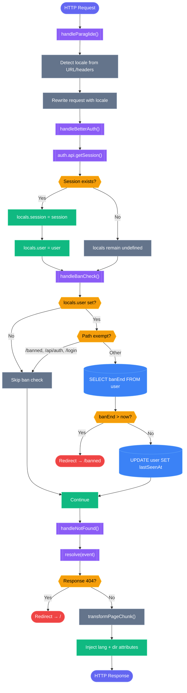

```mermaid
flowchart TD
    A(["HTTP Request"]) --> B[["handleParaglide()"]]
    B --> C["Detect locale from URL/headers"]
    C --> D["Rewrite request with locale"]
    D --> E[["handleBetterAuth()"]]
    E --> F[["auth.api.getSession()"]]
    F --> G{{"Session exists?"}}
    G -->|Yes| H["locals.session = session"]
    H --> I["locals.user = user"]
    G -->|No| J["locals remain undefined"]
    I --> K[["handleBanCheck()"]]
    J --> K
    K --> L{{"locals.user set?"}}
    L -->|No| M["Skip ban check"]
    L -->|Yes| N{{"Path exempt?"}}
    N -->|"/banned, /api/auth, /login"| M
    N -->|Other| O[("SELECT banEnd FROM user")]
    O --> P{{"banEnd > now?"}}
    P -->|Yes| Q(["Redirect → /banned"])
    P -->|No| R[("UPDATE user SET lastSeenAt")]
    R --> S["Continue"]
    M --> S
    S --> T[["handleNotFound()"]]
    T --> U[["resolve(event)"]]
    U --> V{{"Response 404?"}}
    V -->|Yes| W(["Redirect → /"])
    V -->|No| X["transformPageChunk()"]
    X --> Y["Inject lang + dir attributes"]
    Y --> Z(["HTTP Response"])

    classDef entry fill:#6366f1,stroke:#818cf8,color:#fff
    classDef validation fill:#f59e0b,stroke:#fbbf24,color:#000
    classDef success fill:#10b981,stroke:#34d399,color:#fff
    classDef error fill:#ef4444,stroke:#f87171,color:#fff
    classDef external fill:#8b5cf6,stroke:#a78bfa,color:#fff
    classDef data fill:#3b82f6,stroke:#60a5fa,color:#fff
    classDef processing fill:#64748b,stroke:#94a3b8,color:#fff

    class A,Q,W,Z entry
    class G,L,N,P,V validation
    class H,I,S,Y success
    class Q,W error
    class B,E,F,K,T,U external
    class O,R data
    class C,D,J,M,X processing
```
