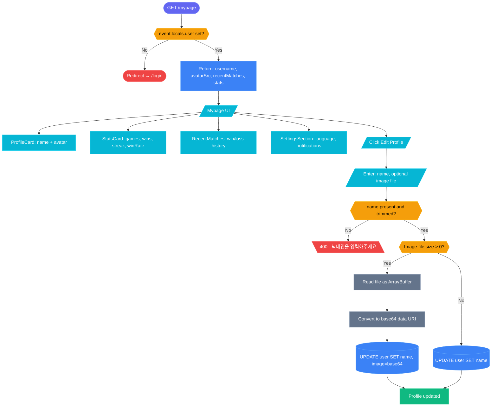

```mermaid
flowchart TD
    A(["GET /mypage"]) --> B{{"event.locals.user set?"}}
    B -->|No| C(["Redirect → /login"])
    B -->|Yes| D["Return: username, avatarSrc, recentMatches, stats"]
    D --> E[/Mypage UI/]
    E --> F["ProfileCard: name + avatar"]
    E --> G["StatsCard: games, wins, streak, winRate"]
    E --> H["RecentMatches: win/loss history"]
    E --> I["SettingsSection: language, notifications"]

    E --> J[/Click Edit Profile/]
    J --> K[/"Enter: name, optional image file"/]
    K --> L{{"name present and trimmed?"}}
    L -->|No| M[\"400 - 닉네임을 입력해주세요"\]
    L -->|Yes| N{{"Image file size > 0?"}}
    N -->|Yes| O["Read file as ArrayBuffer"]
    O --> P["Convert to base64 data URI"]
    P --> Q[("UPDATE user SET name, image=base64")]
    N -->|No| R[("UPDATE user SET name")]
    Q --> S["Profile updated"]
    R --> S

    classDef entry fill:#6366f1,stroke:#818cf8,color:#fff
    classDef validation fill:#f59e0b,stroke:#fbbf24,color:#000
    classDef success fill:#10b981,stroke:#34d399,color:#fff
    classDef error fill:#ef4444,stroke:#f87171,color:#fff
    classDef data fill:#3b82f6,stroke:#60a5fa,color:#fff
    classDef user fill:#06b6d4,stroke:#22d3ee,color:#fff
    classDef processing fill:#64748b,stroke:#94a3b8,color:#fff

    class A,C entry
    class B,L,N validation
    class S success
    class C,M error
    class D,Q,R data
    class E,F,G,H,I,J,K user
    class O,P processing
```
