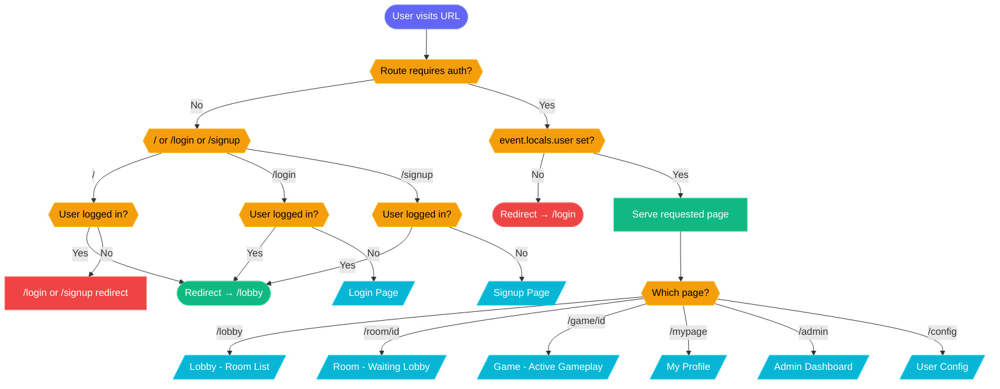

```mermaid
flowchart TD
    A(["User visits URL"]) --> B{{"Route requires auth?"}}
    B -->|No| C{{"/ or /login or /signup"}}
    B -->|Yes| D{{"event.locals.user set?"}}
    D -->|No| E(["Redirect → /login"])
    D -->|Yes| F["Serve requested page"]

    C -->|"/"| G{{"User logged in?"}}
    G -->|Yes| H(["Redirect → /lobby"])
    G -->|No| I["/login or /signup redirect"]

    C -->|"/login"| J{{"User logged in?"}}
    J -->|Yes| H
    J -->|No| K[/Login Page/]

    C -->|"/signup"| L{{"User logged in?"}}
    L -->|Yes| H
    L -->|No| M[/Signup Page/]

    F --> N{{"Which page?"}}
    N -->|"/lobby"| O[/Lobby - Room List/]
    N -->|"/room/id"| P[/Room - Waiting Lobby/]
    N -->|"/game/id"| Q[/Game - Active Gameplay/]
    N -->|"/mypage"| R[/My Profile/]
    N -->|"/admin"| S[/Admin Dashboard/]
    N -->|"/config"| T[/User Config/]

    classDef entry fill:#6366f1,stroke:#818cf8,color:#fff
    classDef validation fill:#f59e0b,stroke:#fbbf24,color:#000
    classDef success fill:#10b981,stroke:#34d399,color:#fff
    classDef error fill:#ef4444,stroke:#f87171,color:#fff
    classDef user fill:#06b6d4,stroke:#22d3ee,color:#fff

    class A entry
    class B,C,D,G,J,L,N validation
    class H,F success
    class E,I error
    class K,M,O,P,Q,R,S,T user
```
