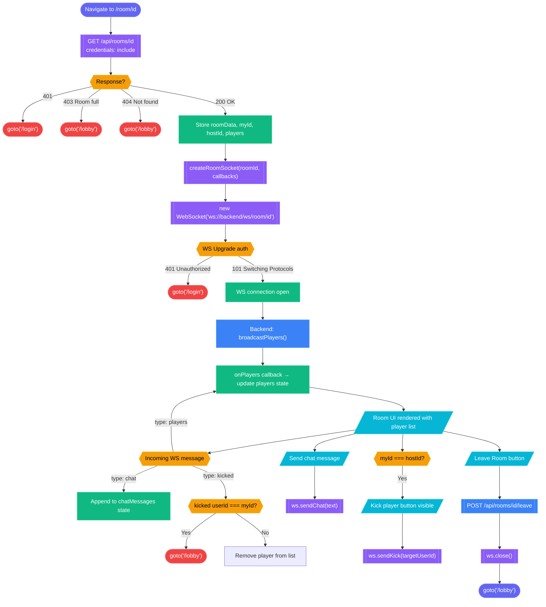

```mermaid
flowchart TD
    A(["Navigate to /room/id"]) --> B[["GET /api/rooms/id\n credentials: include"]]
    B --> C{{"Response?"}}
    C -->|"401"| D(["goto('/login')"])
    C -->|"403 Room full"| E(["goto('/lobby')"])
    C -->|"404 Not found"| F(["goto('/lobby')"])
    C -->|"200 OK"| G["Store roomData, myId, hostId, players"]

    G --> H[["createRoomSocket(roomId, callbacks)"]]
    H --> I[["new WebSocket('ws://backend/ws/room/id')"]]
    I --> J{{"WS Upgrade auth"}}
    J -->|"401 Unauthorized"| K(["goto('/login')"])
    J -->|"101 Switching Protocols"| L["WS connection open"]

    L --> M["Backend: broadcastPlayers()"]
    M --> N["onPlayers callback → update players state"]
    N --> O[/Room UI rendered with player list/]

    O --> P{{"Incoming WS message"}}
    P -->|"type: players"| N
    P -->|"type: chat"| Q["Append to chatMessages state"]
    P -->|"type: kicked"| R{{"kicked userId === myId?"}}
    R -->|Yes| S(["goto('/lobby')"])
    R -->|No| T["Remove player from list"]

    O --> U[/Send chat message/]
    U --> V[["ws.sendChat(text)"]]

    O --> W{{"myId === hostId?"}}
    W -->|Yes| X[/Kick player button visible/]
    X --> Y[["ws.sendKick(targetUserId)"]]

    O --> Z[/Leave Room button/]
    Z --> AA[["POST /api/rooms/id/leave"]]
    AA --> AB[["ws.close()"]]
    AB --> AC(["goto('/lobby')"])

    classDef entry fill:#6366f1,stroke:#818cf8,color:#fff
    classDef validation fill:#f59e0b,stroke:#fbbf24,color:#000
    classDef success fill:#10b981,stroke:#34d399,color:#fff
    classDef error fill:#ef4444,stroke:#f87171,color:#fff
    classDef data fill:#3b82f6,stroke:#60a5fa,color:#fff
    classDef user fill:#06b6d4,stroke:#22d3ee,color:#fff
    classDef external fill:#8b5cf6,stroke:#a78bfa,color:#fff

    class A,D,E,F,K,S,AC entry
    class C,J,P,R,W validation
    class G,L,N,O,Q success
    class D,E,F,K,S error
    class M,AA data
    class O,U,X,Z user
    class B,H,I,V,Y,AB external
```
