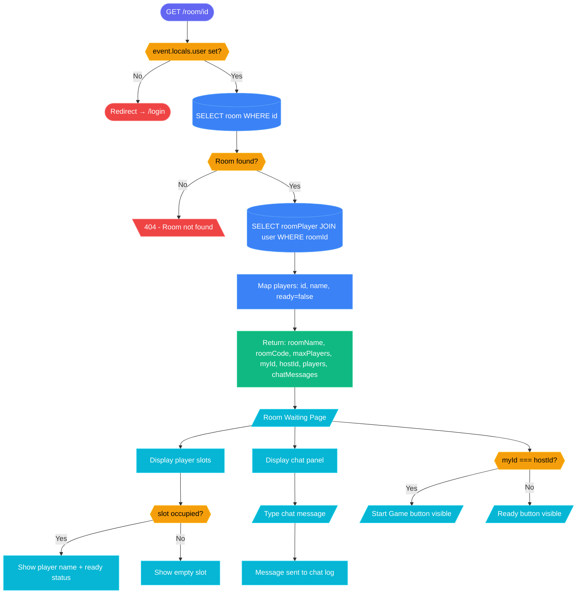

```mermaid
flowchart TD
    A(["GET /room/id"]) --> B{{"event.locals.user set?"}}
    B -->|No| C(["Redirect → /login"])
    B -->|Yes| D[("SELECT room WHERE id")]
    D --> E{{"Room found?"}}
    E -->|No| F[\"404 - Room not found"\]
    E -->|Yes| G[("SELECT roomPlayer JOIN user WHERE roomId")]
    G --> H["Map players: id, name, ready=false"]
    H --> I["Return: roomName, roomCode, maxPlayers, myId, hostId, players, chatMessages"]
    I --> J[/Room Waiting Page/]

    J --> K["Display player slots"]
    K --> L{{"slot occupied?"}}
    L -->|Yes| M["Show player name + ready status"]
    L -->|No| N["Show empty slot"]

    J --> O["Display chat panel"]
    O --> P[/Type chat message/]
    P --> Q["Message sent to chat log"]

    J --> R{{"myId === hostId?"}}
    R -->|Yes| S[/Start Game button visible/]
    R -->|No| T[/Ready button visible/]

    classDef entry fill:#6366f1,stroke:#818cf8,color:#fff
    classDef validation fill:#f59e0b,stroke:#fbbf24,color:#000
    classDef success fill:#10b981,stroke:#34d399,color:#fff
    classDef error fill:#ef4444,stroke:#f87171,color:#fff
    classDef data fill:#3b82f6,stroke:#60a5fa,color:#fff
    classDef user fill:#06b6d4,stroke:#22d3ee,color:#fff

    class A,C entry
    class B,E,L,R validation
    class I,J success
    class C,F error
    class D,G,H data
    class J,K,M,N,O,P,Q,S,T user
```
