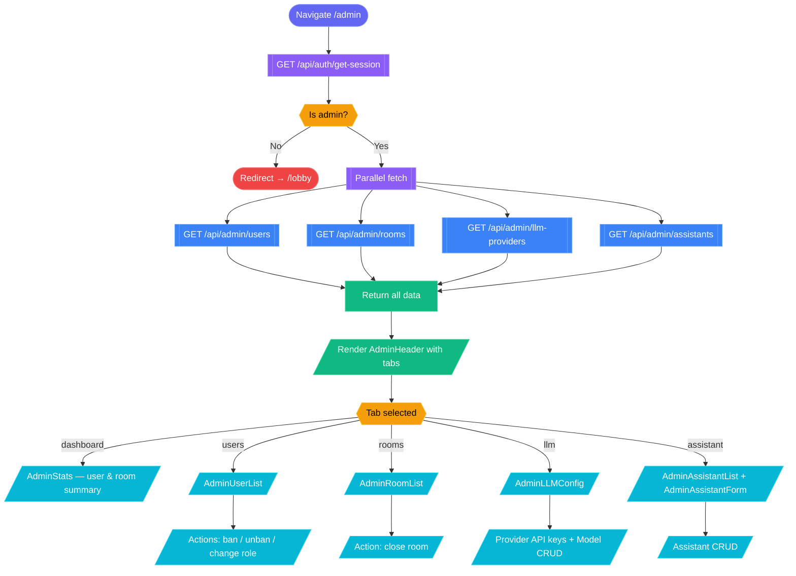

```mermaid
flowchart TD
    A(["Navigate /admin"]) --> B[["GET /api/auth/get-session"]]
    B --> C{{"Is admin?"}}
    C -->|No| D(["Redirect → /lobby"])
    C -->|Yes| E[["Parallel fetch"]]

    E --> F[["GET /api/admin/users"]]
    E --> G[["GET /api/admin/rooms"]]
    E --> H[["GET /api/admin/llm-providers"]]
    E --> I[["GET /api/admin/assistants"]]

    F & G & H & I --> J["Return all data"]
    J --> K[/Render AdminHeader with tabs/]

    K --> L{{"Tab selected"}}
    L -->|"dashboard"| M[/AdminStats — user & room summary/]
    L -->|"users"| N[/AdminUserList/]
    L -->|"rooms"| O[/AdminRoomList/]
    L -->|"llm"| P[/AdminLLMConfig/]
    L -->|"assistant"| Q[/AdminAssistantList + AdminAssistantForm/]

    N --> R[/"Actions: ban / unban / change role"/]
    O --> S[/"Action: close room"/]
    P --> T[/"Provider API keys + Model CRUD"/]
    Q --> U[/"Assistant CRUD"/]

    classDef entry fill:#6366f1,stroke:#818cf8,color:#fff
    classDef validation fill:#f59e0b,stroke:#fbbf24,color:#000
    classDef success fill:#10b981,stroke:#34d399,color:#fff
    classDef error fill:#ef4444,stroke:#f87171,color:#fff
    classDef data fill:#3b82f6,stroke:#60a5fa,color:#fff
    classDef user fill:#06b6d4,stroke:#22d3ee,color:#fff
    classDef external fill:#8b5cf6,stroke:#a78bfa,color:#fff

    class A,D entry
    class C,L validation
    class J,K success
    class D error
    class F,G,H,I data
    class M,N,O,P,Q,R,S,T,U user
    class B,E external
```
