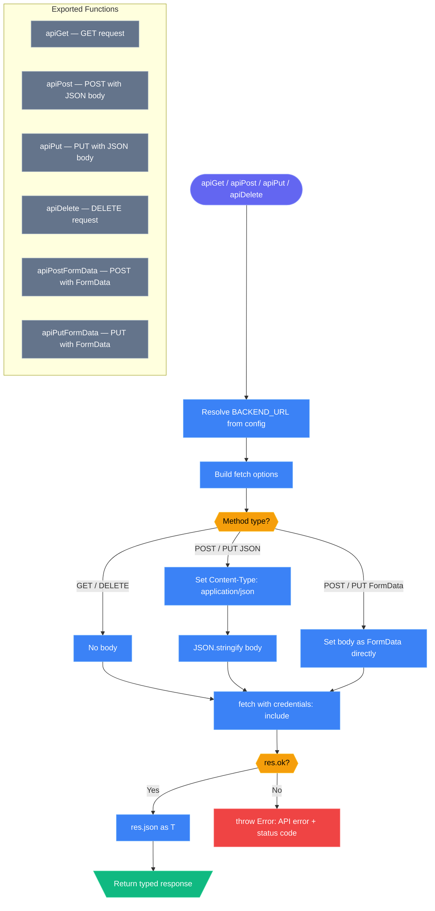

```mermaid
flowchart TD
    A(["apiGet / apiPost / apiPut / apiDelete"]) --> B["Resolve BACKEND_URL from config"]
    B --> C["Build fetch options"]

    C --> D{{"Method type?"}}
    D -->|GET / DELETE| E["No body"]
    D -->|POST / PUT JSON| F["Set Content-Type: application/json"]
    F --> G["JSON.stringify body"]
    D -->|POST / PUT FormData| H["Set body as FormData directly"]

    E --> I["fetch with credentials: include"]
    G --> I
    H --> I

    I --> J{{"res.ok?"}}
    J -->|Yes| K["res.json as T"]
    K --> L[\Return typed response/]
    J -->|No| M["throw Error: API error + status code"]

    subgraph Exported Functions
        N["apiGet — GET request"]
        O["apiPost — POST with JSON body"]
        P["apiPut — PUT with JSON body"]
        Q["apiDelete — DELETE request"]
        R["apiPostFormData — POST with FormData"]
        S["apiPutFormData — PUT with FormData"]
    end

    classDef entry fill:#6366f1,stroke:#818cf8,color:#fff
    classDef validation fill:#f59e0b,stroke:#fbbf24,color:#000
    classDef success fill:#10b981,stroke:#34d399,color:#fff
    classDef error fill:#ef4444,stroke:#f87171,color:#fff
    classDef data fill:#3b82f6,stroke:#60a5fa,color:#fff
    classDef info fill:#64748b,stroke:#94a3b8,color:#fff

    class A entry
    class D,J validation
    class L success
    class M error
    class B,C,E,F,G,H,I,K data
    class N,O,P,Q,R,S info
```
