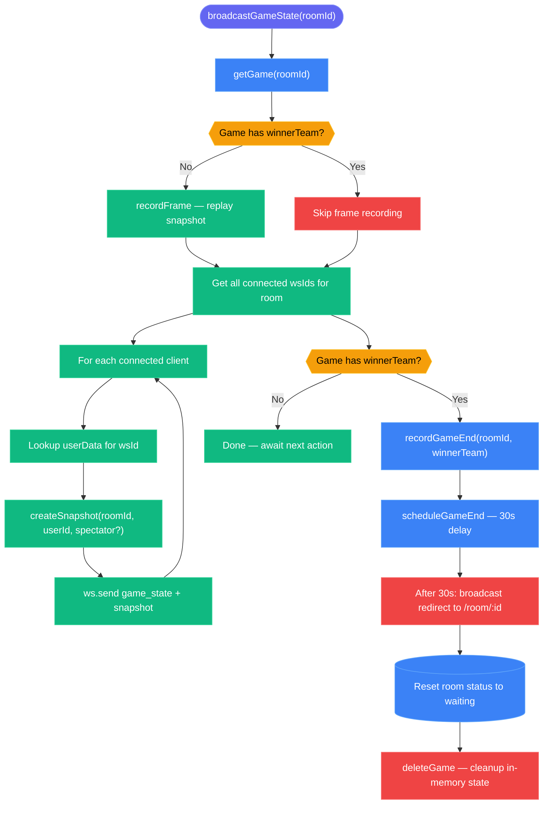

```mermaid
flowchart TD
    A(["broadcastGameState(roomId)"]) --> B["getGame(roomId)"]
    B --> C{{"Game has winnerTeam?"}}
    C -->|No| D["recordFrame — replay snapshot"]
    C -->|Yes| E["Skip frame recording"]
    D --> F["Get all connected wsIds for room"]
    E --> F
    F --> G["For each connected client"]
    G --> H["Lookup userData for wsId"]
    H --> I["createSnapshot(roomId, userId, spectator?)"]
    I --> J["ws.send game_state + snapshot"]
    J --> G

    F --> K{{"Game has winnerTeam?"}}
    K -->|No| L["Done — await next action"]
    K -->|Yes| M["recordGameEnd(roomId, winnerTeam)"]
    M --> N["scheduleGameEnd — 30s delay"]
    N --> O["After 30s: broadcast redirect to /room/:id"]
    O --> P[(Reset room status to waiting)]
    P --> Q["deleteGame — cleanup in-memory state"]

    classDef entry fill:#6366f1,stroke:#818cf8,color:#fff
    classDef validation fill:#f59e0b,stroke:#fbbf24,color:#000
    classDef success fill:#10b981,stroke:#34d399,color:#fff
    classDef error fill:#ef4444,stroke:#f87171,color:#fff
    classDef data fill:#3b82f6,stroke:#60a5fa,color:#fff

    class A entry
    class C,K validation
    class D,F,G,H,I,J,L success
    class E,O,Q error
    class B,M,N,P data
```
