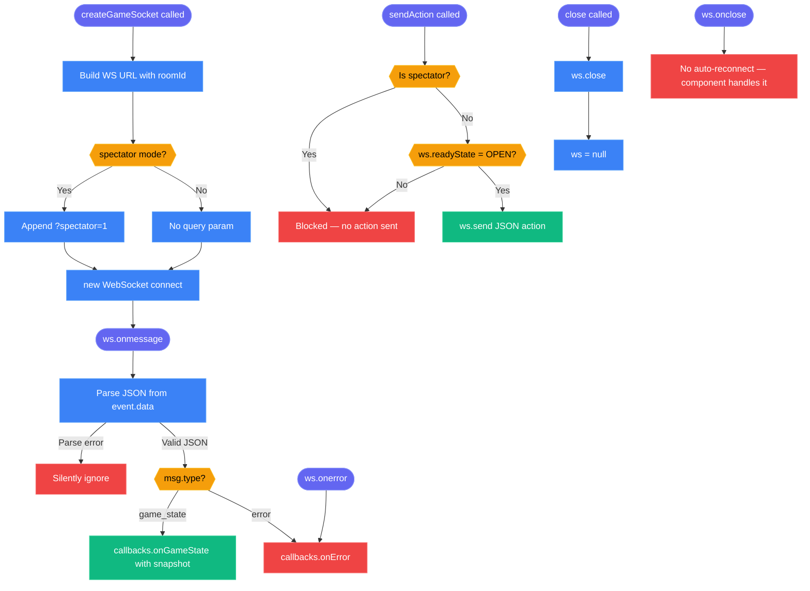

```mermaid
flowchart TD
    A(["createGameSocket called"]) --> B["Build WS URL with roomId"]
    B --> C{{"spectator mode?"}}
    C -->|Yes| D["Append ?spectator=1"]
    C -->|No| E["No query param"]
    D --> F["new WebSocket connect"]
    E --> F

    F --> G(["ws.onmessage"])
    G --> H["Parse JSON from event.data"]
    H -->|Parse error| I["Silently ignore"]
    H -->|Valid JSON| J{{"msg.type?"}}
    J -->|game_state| K["callbacks.onGameState with snapshot"]
    J -->|error| L["callbacks.onError"]

    M(["sendAction called"]) --> N{{"Is spectator?"}}
    N -->|Yes| O["Blocked — no action sent"]
    N -->|No| P{{"ws.readyState = OPEN?"}}
    P -->|No| O
    P -->|Yes| Q["ws.send JSON action"]

    R(["close called"]) --> S["ws.close"]
    S --> T["ws = null"]

    U(["ws.onerror"]) --> L
    V(["ws.onclose"]) --> W["No auto-reconnect — component handles it"]

    classDef entry fill:#6366f1,stroke:#818cf8,color:#fff
    classDef validation fill:#f59e0b,stroke:#fbbf24,color:#000
    classDef success fill:#10b981,stroke:#34d399,color:#fff
    classDef error fill:#ef4444,stroke:#f87171,color:#fff
    classDef data fill:#3b82f6,stroke:#60a5fa,color:#fff

    class A,G,M,R,U,V entry
    class C,J,N,P validation
    class K,Q success
    class I,L,O,W error
    class B,D,E,F,H,S,T data
```
