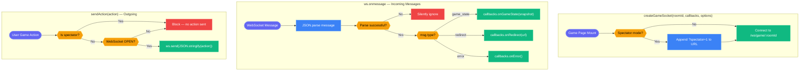

```mermaid
flowchart TD
    subgraph Connect ["createGameSocket(roomId, callbacks, options)"]
        A(["Game Page Mount"]) --> B{{"Spectator mode?"}}
        B -->|Yes| C["Append ?spectator=1 to URL"]
        B -->|No| D["Connect to /ws/game/:roomId"]
        C --> D
    end

    subgraph Receive ["ws.onmessage — Incoming Messages"]
        E(["WebSocket Message"]) --> F["JSON.parse message"]
        F --> G{{"Parse successful?"}}
        G -->|No| H["Silently ignore"]
        G -->|Yes| I{{"msg.type?"}}
        I -->|game_state| J["callbacks.onGameState(snapshot)"]
        I -->|redirect| K["callbacks.onRedirect(url)"]
        I -->|error| L["callbacks.onError()"]
    end

    subgraph Send ["sendAction(action) — Outgoing"]
        M(["User Game Action"]) --> N{{"Is spectator?"}}
        N -->|Yes| O["Block — no action sent"]
        N -->|No| P{{"WebSocket OPEN?"}}
        P -->|No| O
        P -->|Yes| Q["ws.send(JSON.stringify(action))"]
    end

    classDef entry fill:#6366f1,stroke:#818cf8,color:#fff
    classDef validation fill:#f59e0b,stroke:#fbbf24,color:#000
    classDef success fill:#10b981,stroke:#34d399,color:#fff
    classDef error fill:#ef4444,stroke:#f87171,color:#fff
    classDef data fill:#3b82f6,stroke:#60a5fa,color:#fff

    class A,E,M entry
    class B,G,I,N,P validation
    class D,J,K,L,Q success
    class H,O error
    class C,F data
```
