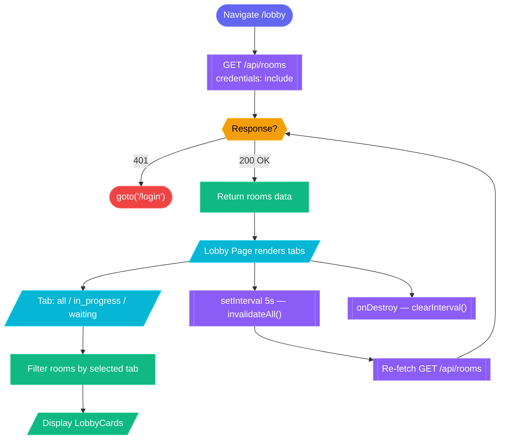

```mermaid
flowchart TD
    A(["Navigate /lobby"]) --> B[["GET /api/rooms\n credentials: include"]]
    B --> C{{"Response?"}}
    C -->|"401"| D(["goto('/login')"])
    C -->|"200 OK"| E["Return rooms data"]

    E --> F[/Lobby Page renders tabs/]
    F --> G[/"Tab: all / in_progress / waiting"/]
    G --> H["Filter rooms by selected tab"]
    H --> I[/Display LobbyCards/]

    F --> J[["setInterval 5s — invalidateAll()"]]
    J --> K[["Re-fetch GET /api/rooms"]]
    K --> C

    F --> L[["onDestroy — clearInterval()"]]

    classDef entry fill:#6366f1,stroke:#818cf8,color:#fff
    classDef validation fill:#f59e0b,stroke:#fbbf24,color:#000
    classDef success fill:#10b981,stroke:#34d399,color:#fff
    classDef error fill:#ef4444,stroke:#f87171,color:#fff
    classDef data fill:#3b82f6,stroke:#60a5fa,color:#fff
    classDef user fill:#06b6d4,stroke:#22d3ee,color:#fff
    classDef external fill:#8b5cf6,stroke:#a78bfa,color:#fff

    class A,D entry
    class C validation
    class E,H,I success
    class D error
    class F,G user
    class B,J,K,L external
```
