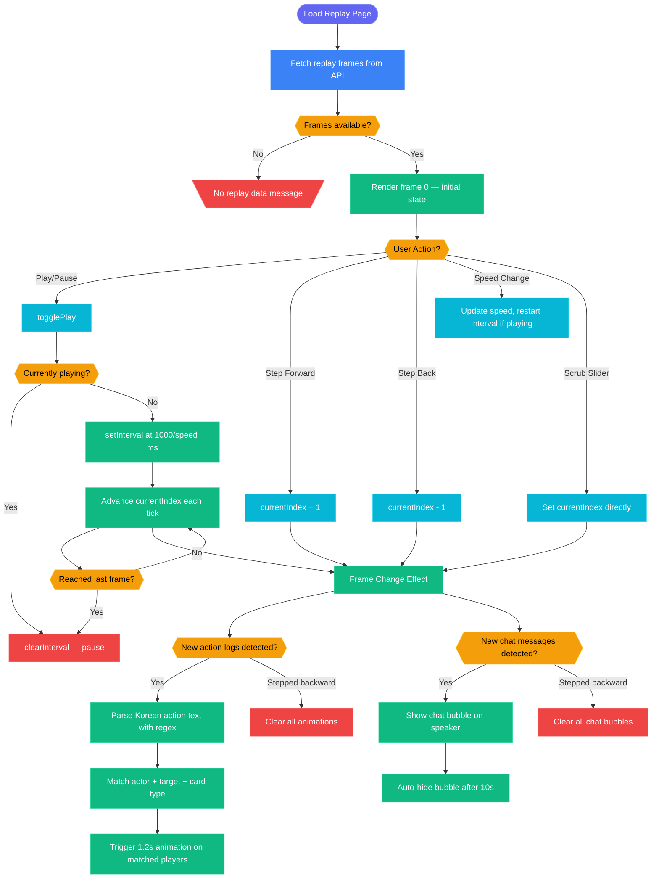

```mermaid
flowchart TD
    A(["Load Replay Page"]) --> B["Fetch replay frames from API"]
    B --> C{{"Frames available?"}}
    C -->|No| D[\"No replay data message"/]
    C -->|Yes| E["Render frame 0 — initial state"]

    E --> F{{"User Action?"}}
    F -->|Play/Pause| G["togglePlay"]
    G --> H{{"Currently playing?"}}
    H -->|Yes| I["clearInterval — pause"]
    H -->|No| J["setInterval at 1000/speed ms"]
    J --> K["Advance currentIndex each tick"]
    K --> L{{"Reached last frame?"}}
    L -->|Yes| I
    L -->|No| K

    F -->|Step Forward| M["currentIndex + 1"]
    F -->|Step Back| N["currentIndex - 1"]
    F -->|Speed Change| O["Update speed, restart interval if playing"]
    F -->|Scrub Slider| P["Set currentIndex directly"]

    M --> Q["Frame Change Effect"]
    N --> Q
    K --> Q
    P --> Q

    Q --> R{{"New action logs detected?"}}
    R -->|Yes| S["Parse Korean action text with regex"]
    S --> T["Match actor + target + card type"]
    T --> U["Trigger 1.2s animation on matched players"]
    R -->|Stepped backward| V["Clear all animations"]

    Q --> W{{"New chat messages detected?"}}
    W -->|Yes| X["Show chat bubble on speaker"]
    X --> Y["Auto-hide bubble after 10s"]
    W -->|Stepped backward| Z["Clear all chat bubbles"]

    classDef entry fill:#6366f1,stroke:#818cf8,color:#fff
    classDef validation fill:#f59e0b,stroke:#fbbf24,color:#000
    classDef success fill:#10b981,stroke:#34d399,color:#fff
    classDef error fill:#ef4444,stroke:#f87171,color:#fff
    classDef data fill:#3b82f6,stroke:#60a5fa,color:#fff
    classDef user fill:#06b6d4,stroke:#22d3ee,color:#fff

    class A entry
    class C,H,L,R,W,F validation
    class E,J,K,Q,S,T,U,X,Y success
    class D,I,V,Z error
    class G,M,N,O,P user
    class B data
```
