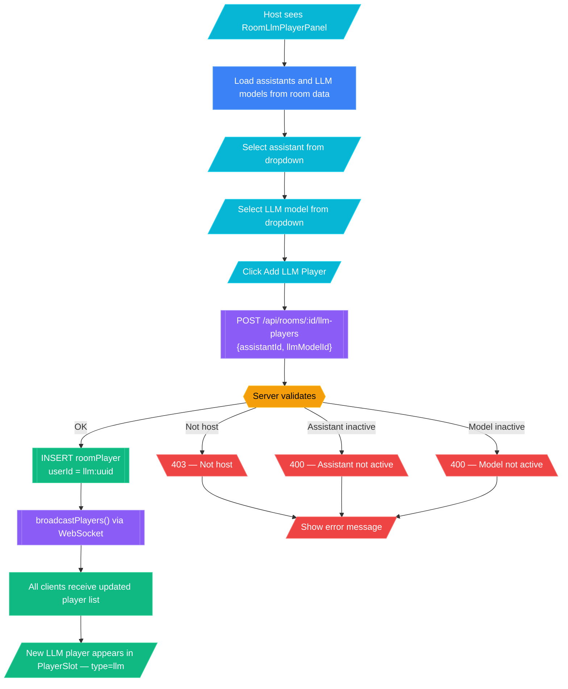

```mermaid
flowchart TD
    A[/Host sees RoomLlmPlayerPanel/] --> B["Load assistants and LLM models from room data"]
    B --> C[/"Select assistant from dropdown"/]
    C --> D[/"Select LLM model from dropdown"/]
    D --> E[/"Click Add LLM Player"/]
    E --> F[["POST /api/rooms/:id/llm-players\n{assistantId, llmModelId}"]]
    F --> G{{"Server validates"}}
    G -->|"Not host"| H[\"403 — Not host"\]
    G -->|"Assistant inactive"| I[\"400 — Assistant not active"\]
    G -->|"Model inactive"| J[\"400 — Model not active"\]
    G -->|"OK"| K[["INSERT roomPlayer\nuserId = llm:uuid"]]
    K --> L[["broadcastPlayers() via WebSocket"]]
    L --> M["All clients receive updated player list"]
    M --> N[/New LLM player appears in PlayerSlot — type=llm/]

    H --> O[/Show error message/]
    I --> O
    J --> O

    classDef entry fill:#6366f1,stroke:#818cf8,color:#fff
    classDef validation fill:#f59e0b,stroke:#fbbf24,color:#000
    classDef success fill:#10b981,stroke:#34d399,color:#fff
    classDef error fill:#ef4444,stroke:#f87171,color:#fff
    classDef data fill:#3b82f6,stroke:#60a5fa,color:#fff
    classDef user fill:#06b6d4,stroke:#22d3ee,color:#fff
    classDef external fill:#8b5cf6,stroke:#a78bfa,color:#fff

    class G validation
    class K,M,N success
    class H,I,J error
    class O error
    class A,C,D,E user
    class B data
    class F,L external
```
