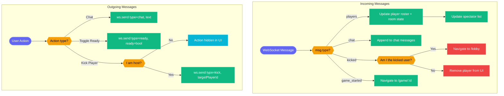

```mermaid
flowchart TD
    subgraph Receive ["Incoming Messages"]
        A(["WebSocket Message"]) --> B{{"msg.type?"}}
        B -->|players| C["Update player roster + room state"]
        C --> D["Update spectator list"]
        B -->|chat| E["Append to chat messages"]
        B -->|kicked| F{{"Am I the kicked user?"}}
        F -->|Yes| G["Navigate to /lobby"]
        F -->|No| H["Remove player from UI"]
        B -->|game_started| I["Navigate to /game/:id"]
    end

    subgraph Send ["Outgoing Messages"]
        J(["User Action"]) --> K{{"Action type?"}}
        K -->|Chat| L["ws.send type=chat, text"]
        K -->|Toggle Ready| M["ws.send type=ready, ready=bool"]
        K -->|Kick Player| N{{"I am host?"}}
        N -->|No| O["Action hidden in UI"]
        N -->|Yes| P["ws.send type=kick, targetPlayerId"]
    end

    classDef entry fill:#6366f1,stroke:#818cf8,color:#fff
    classDef validation fill:#f59e0b,stroke:#fbbf24,color:#000
    classDef success fill:#10b981,stroke:#34d399,color:#fff
    classDef error fill:#ef4444,stroke:#f87171,color:#fff
    classDef user fill:#06b6d4,stroke:#22d3ee,color:#fff

    class A,J entry
    class B,F,K,N validation
    class C,D,E,I,L,M,P success
    class G,H error
    class O user
```
